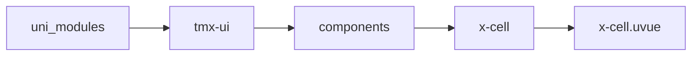
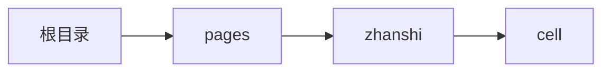

# 列表 xCell
-------
<ViewMobile url="/pages/zhanshi/cell" />

## 介绍

card为true时，圆角可统一全局配置和动态全局配置，保持所有页面列表样式统一，免于一个一个配置。

## 平台兼容

| Harmony | H5 | andriod | IOS | 小程序 | UTS | UNIAPP-X SDK | version |
| --- | --- | --- | --- | --- | --- | --- | --- |
| ☑ | ☑ | ☑️ | ☑️ | ☑️ | ☑️ | 4.76+ | 1.1.18 |


## 文件路径

``` ts

@/uni_modules/tmx-ui/components/x-cell/x-cell.uvue
```



## 使用

``` ts

<x-cell></x-cell>
```

## Props 属性

| 名称 | 说明 | 类型 | 默认值 |
| ------ | ---- | ---- | ---- |
| icon | `左图标`<br> | `string` | `""` |
| avatarRound | `左侧图标、头像圆角。默认为8`<br> | `string` | `"8"` |
| color | `背景的主题色`<br> | `string` | `'white'` |
| darkColor | `暗黑背景的主题色，空值时取sheetDarkColor`<br> | `string` | `''` |
| iconColor | `图标色,空值时取全局主题值。`<br> | `string` | `""` |
| title | `标题`<br> | `string` | `"标题"` |
| titleColor | `标题颜色`<br> | `string` | `"black"` |
| darkTitleColor | `暗黑标题颜色，如果不填写取白`<br> | `string` | `"white"` |
| titleSize | `标题大小`<br> | `string` | `"16"` |
| iconSize | `图标大小`<br> | `string` | `"24"` |
| label | `右边文本`<br> | `string` | `""` |
| labelColor | `右边文本颜色`<br> | `string` | `"#bfbfbf"` |
| darklabelColor | ``<br> | `string` | `""` |
| labelSize | `右侧label文字大小`<br> | `string` | `"13"` |
| desc | `标题正文的简介文本`<br> | `string` | `""` |
| showBottomBorder | `是否显示下边线`<br> | `boolean` | `true` |
| bottomBorderInsert | `是否让下边线显示居右，不贯穿到左边。`<br> | `boolean` | `false` |
| bottomBorderColor | `下边线的颜色。如果你设定了的话。`<br>`暗黑的边颜色失效，采用你自定的颜色。`<br> | `string` | `""` |
| link | `是否显示链接状态，有点按效果。包括出现右边跳转指示。`<br>`关闭的话，事件反应和跳转会更快。`<br>`如果true右侧箭头图标会显示`<br> | `boolean` | `true` |
| linkColor | `右指示图标的颜色`<br> | `string` | `'#bfbfbf'` |
| linkDarkColor | `右指示图标的暗黑颜色`<br> | `string` | `'#bfbfbf'` |
| url | `需要跳转的页面地址。`<br>`如果填写了右侧箭头图标会显示`<br>`跳转时如果失败会回退到switchTab跳转。`<br> | `string` | `""` |
| card | `是否是卡片模式`<br> | `boolean` | `true` |
| round | `卡片模式圆角,不填写采用全局的cardRadius属性值.`<br> | `string` | `""` |
| leftSize | `左边图标区域宽和高的大小。`<br> | `string` | `'32'` |
| minHeight | `最小高度，主要是用来统一风格高度不至于让点击范围过小`<br>`如果你需要紧凑型可以设置为auto`<br> | `string` | `"55"` |
| disabled | `是否禁用url跳转，当link为true或者url需要跳转时`<br>`如果禁用，点击时不会触发跳转。`<br> | `boolean` | `false` |
| padding | `内间隙[x]全部,[x,x]左右，上下,[x,x,x]左上右,[x,x,x,x]左上右下`<br>`空数组时取全局值`<br> | `Array` | `() : string[] => ['12', '0'] as string[]` |
| margin | `margin 同sheet原理`<br>`[x]全部,[x,x]左右，上下,[x,x,x]左上右,[x,x,x,x]左上右下`<br>`空数组时取全局值cellMargin`<br> | `Array` | `() : string[] => [] as string[]` |
| rightWidth | `右侧label宽，插槽时，这个属性不会生效`<br>`以你自己布局宽为准。`<br> | `string` | `"100"` |


## Events 事件

| 名称 | 参数 | 说明 |
| ------ | ---- | ---- |
| click | `-` | 项目点击 |
| update:show | `-` | 等同v-model:show |


## Slots 插槽

| 名称 | 说明 | 数据 |
| ------ | ---- | ---- |
| avatar | `头像图标` | icon: string<br> |
| default | `默认标题插槽` | - |
| desc | `简介` | desc: string<br> |
| label | `右边文字` | label: string<br> |
| right | `右插槽` | - |


## Ref 方法

| 名称 | 参数 | 返回值 | 说明 |
| ------ | ---- | ---- | ---- |


## 示例文件路径

``` json

/pages/zhanshi/cell
```



## 示例源码

::: details uvue

<<< ../../../../pages/zhanshi/cell.uvue{vue}

:::

