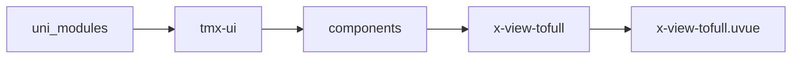
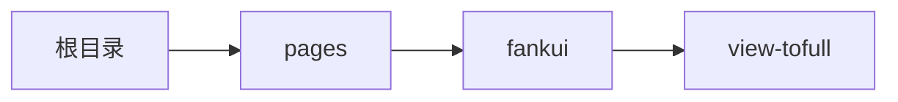

# 动态全屏 xViewTofull
-------
<ViewMobile url="/pages/fankui/view-tofull" />

## 介绍

动态全屏，点击某一区域时，让该内容自动全屏展开，关闭时，回落到原位置，场景比如：视频播放，详情等不想开新页面的时候非常有用。
如果想完全全屏，可以自定义导航栏和自定义关闭按钮实现。web端使用时注意：不能套在父组件设置了css transform属性里面，否则错乱。

## 平台兼容

| Harmony | H5 | andriod | IOS | 小程序 | UTS | UNIAPP-X SDK | version |
| --- | --- | --- | --- | --- | --- | --- | --- |
| ☑ | ☑ | ☑️ | ☑️ | ☑️ | ☑️ | 4.76+ | 1.1.18 |


## 文件路径

``` ts

@/uni_modules/tmx-ui/components/x-view-tofull/x-view-tofull.uvue
```



## 使用

``` ts

<x-view-tofull></x-view-tofull>
```

## Props 属性

| 名称 | 说明 | 类型 | 默认值 |
| ------ | ---- | ---- | ---- |
| bgColor | `全屏弹出来时的背景色。`<br> | `string` | `'#ffffff'` |
| darkBgColor | `全屏弹出来时的暗黑背景色。`<br>`默认为空，取全局的暗黑背景`<br> | `string` | `''` |
| duration | `展开时的动画时长，单位ms`<br> | `number` | `300` |
| showClose | `是否显示关闭按钮`<br>`你可以关闭，通过ref来关闭。`<br>`如果要全屏可以自定义导航栏。`<br> | `boolean` | `true` |


## Events 事件

| 名称 | 参数 | 说明 |
| ------ | ---- | ---- |


## Slots 插槽

| 名称 | 说明 | 数据 |
| ------ | ---- | ---- |
| close | `关闭按钮插槽` | opened: boolean<br> |
| default | `默认内容插槽` | opened: boolean<br> |


## Ref 方法

| 名称 | 参数 | 返回值 | 说明 |
| ------ | ---- | ---- | ---- |
| open | - | `-` | - |
| close | - | `-` | - |


## 示例文件路径

``` json

/pages/fankui/view-tofull
```



## 示例源码

::: details uvue

<<< ../../../../pages/fankui/view-tofull.uvue{vue}

:::

