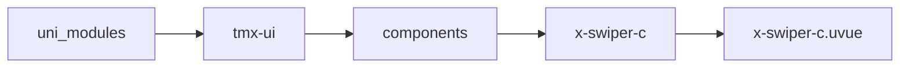
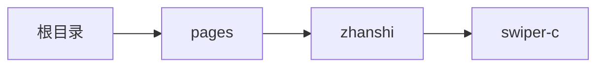

# 动效轮播 xSwiperC
-------
<ViewMobile url="/pages/zhanshi/swiper-c" />

## 介绍

此轮播专注于动效效果，不支持子组件，与x-swiper不同。丰富的插件数据及丰富的动效及缓动函数均可自定义，动画相对平缓流畅，动画酷炫。

## 平台兼容

| Harmony | H5 | andriod | IOS | 小程序 | UTS | UNIAPP-X SDK | version |
| --- | --- | --- | --- | --- | --- | --- | --- |
| ☑ | ☑ | ☑️ | ☑️ | ☑️ | ☑️ | 4.81+ | 1.1.19 |


## 文件路径

``` ts

@/uni_modules/tmx-ui/components/x-swiper-c/x-swiper-c.uvue
```



## 使用

``` ts

<x-swiper-c></x-swiper-c>
```

## Props 属性

| 名称 | 说明 | 类型 | 默认值 |
| ------ | ---- | ---- | ---- |
| height | `轮播的高`<br> | `union` | `200` |
| easing | `缓动动画函数`<br> | `union` | `'easeOutQuad'` |
| effect | `动画效果，如果你是竖向播放设置了vertical，你要根据下面的效果来配合，比如你向上下拉竖的时候配合SimpleSlideYEffect等效果就体验好`<br> | `union` | `'StretchXEffect'` |
| autoPlay | `是否自动播放`<br> | `boolean` | `true` |
| duration | `动画播放时间`<br> | `number` | `600` |
| interval | `间隔时间`<br> | `number` | `3500` |
| circular | `是否首尾衔接`<br> | `boolean` | `true` |
| vertical | `是否竖向播放,需要配合动效effect达到视觉上的上下效果`<br> | `boolean` | `false` |
| imageFit | `图片填充模式：'fill'=拉伸填充, 'cover'=裁剪居中显示`<br> | `union` | `'cover'` |
| swipeThreshold | `滑动切换的最小距离阈值（像素）`<br> | `number` | `60` |
| current | `当前索引值。`<br> | `number` | `0` |
| list | `当前项目数据,如果你想要轮播图片，里面必须要有image字段，如果想要纯背景色或者带背景色必须要有color字段，其它值可以放在data内。`<br> | `Array` | `():UTSJSONObject[] => [] as UTSJSONObject[]` |
| dotColor | `dot默认颜色`<br> | `string` | `'rgba(255,255,255,0.5)'` |
| dotActiveColor | `dot激活项的颜色,空值时取全局值。`<br> | `string` | `''` |
| dotSize | `px单位，dot大小。`<br> | `number` | `8` |
| dotBottom | `px单位距离底部距离`<br> | `number` | `16` |


## Events 事件

| 名称 | 参数 | 说明 |
| ------ | ---- | ---- |
| change | `current: number` | 切换时触发。 |
| click | `current: number` | 组件被点击时触发。 |


## Slots 插槽

| 名称 | 说明 | 数据 |
| ------ | ---- | ---- |
| default | `-` | - |
| dot | `-` | - |


## Ref 方法

| 名称 | 参数 | 返回值 | 说明 |
| ------ | ---- | ---- | ---- |
| prev | - | `-` | 上一项 |
| next | - | `-` | 下一项 |
| switchToIndex | - | `-` | 播放到指定项 |
| start | - | `-` | 开始自动播放 |
| stop | - | `-` | 停止自动播放,并将进度，索引等重置为起始位置 |
| pause | - | `-` | 暂停播放 |
| resume | - | `-` | 恢复上一次暂停位置处，并继续播放 |


## 示例文件路径

``` json

/pages/zhanshi/swiper-c
```



## 示例源码

::: details uvue

<<< ../../../../pages/zhanshi/swiper-c.uvue{vue}

:::

