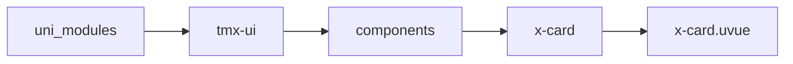
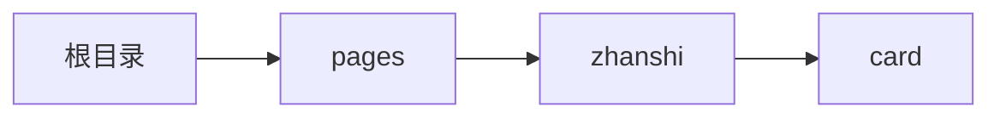

# 卡片 xCard
-------
<ViewMobile url="/pages/zhanshi/card" />

## 介绍

圆角，主题可统一全局配置风格。

## 平台兼容

| Harmony | H5 | andriod | IOS | 小程序 | UTS | UNIAPP-X SDK | version |
| --- | --- | --- | --- | --- | --- | --- | --- |
| ☑ | ☑ | ☑️ | ☑️ | ☑️ | ☑️ | 4.76+ | 1.1.18 |


## 文件路径

``` ts

@/uni_modules/tmx-ui/components/x-card/x-card.uvue
```



## 使用

``` ts

<x-card></x-card>
```

## Props 属性

| 名称 | 说明 | 类型 | 默认值 |
| ------ | ---- | ---- | ---- |
| padding | `内容的内边距。`<br> | `string` | `"16"` |
| titleSize | `标题文字大小`<br> | `string` | `"18"` |
| btnColor | `按钮颜色`<br> | `string` | `""` |
| color | `标题颜色`<br> | `string` | `"#333333"` |
| bgColor | `背景颜色`<br> | `string` | `"#ffffff"` |
| darkBgColor | `暗黑背景颜色，如果为空，取sheetDarkColor`<br> | `string` | `""` |
| btns | `底部按钮数组。如果不满意风格布局请使用插槽footer来布局`<br> | `Array` | `() : string[] => [] as string[]` |
| subtitle | `副标题`<br> | `string` | `""` |
| title | `标题`<br> | `string` | `""` |
| statusIcon | `右边的小图标，如果你是想显示状态，日期请使用对应插槽`<br> | `string` | `"more-fill"` |
| content | `中间内容。如果有大量内容请直接在默认插槽(标签内)内布局`<br> | `string` | `""` |
| image | `头部图片地址。`<br> | `string` | `""` |
| imageHeight | `头图片高度`<br> | `string` | `"150"` |
| round | `圆角请不要动态更改此会，默认为空，取全局设置的风格值。`<br> | `string` | `""` |
| shadow | `请不要动态更改些投影值，截止4.75+鸿蒙无法使用投影`<br> | `string` | `"0 3px 10px rgba(0, 0, 0, 0.05)"` |
| btnSize | `按钮尺寸`<br> | `BtnSizeType` | `"small" as BtnSizeType` |


## Events 事件

| 名称 | 参数 | 说明 |
| ------ | ---- | ---- |
| click | `-` | 卡片被点击 |
| status | `-` | 右边状态小图标被点击 |
| action | `-` | 底部按钮被点击 |


## Slots 插槽

| 名称 | 说明 | 数据 |
| ------ | ---- | ---- |
| image | `图片插槽` | - |
| title | `标题插槽` | - |
| statusIcon | `状态右边小图标插槽` | - |
| subtitle | `副标题插槽` | - |
| default | `默认内容插槽` | - |
| footer | `底部插槽` | - |


## Ref 方法

| 名称 | 参数 | 返回值 | 说明 |
| ------ | ---- | ---- | ---- |


## 示例文件路径

``` json

/pages/zhanshi/card
```



## 示例源码

::: details uvue

<<< ../../../../pages/zhanshi/card.uvue{vue}

:::

