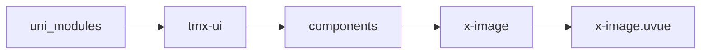
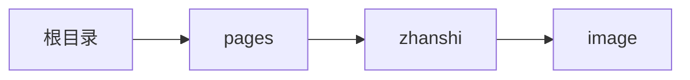

# 图片 xImage
-------
<ViewMobile url="/pages/zhanshi/image" />

## 介绍

宽高可以设置，支持百分比，px,rpx

## 平台兼容

| Harmony | H5 | andriod | IOS | 小程序 | UTS | UNIAPP-X SDK | version |
| --- | --- | --- | --- | --- | --- | --- | --- |
| ☑ | ☑ | ☑️ | ☑️ | ☑️ | ☑️ | 4.76+ | 1.1.18 |


## 文件路径

``` ts

@/uni_modules/tmx-ui/components/x-image/x-image.uvue
```



## 使用

``` ts

<x-image></x-image>
```

## Props 属性

| 名称 | 说明 | 类型 | 默认值 |
| ------ | ---- | ---- | ---- |
| width | `宽度，18rpx,18px,15%，只写"18"表示18rpx`<br> | `string` | `"100%"` |
| height | `高度，auto,%,rpx,px`<br> | `string` | `"auto"` |
| src | `图片源`<br> | `string` | `""` |
| previewSrc | `预览的图片源，为空则与src同步`<br> | `string` | `""` |
| model | `模式`<br> | `IMG_MODEL` | `"fill"` |
| preview | `点击后是否预览图片,默认值是'null'字符串哦，这样就可以读取全局统一的配置，因为在x平台空值就会编译为true，因此使用字符串null代替空值。`<br> | `union` | `"null"` |
| ratio | `预览占位比例 宽/高，默认5/4=1.25`<br> | `number` | `1.25` |
| round | `圆角`<br> | `string` | `'0'` |
| iconSize | `加载和失败时的图标大小`<br> | `string` | `"16"` |
| placeBgColor | `占位背景色`<br> | `string` | `"#F5F5F5"` |
| placeDarkBgColor | `占位暗黑时的背景，不填默认inputDarkColor`<br> | `string` | `""` |
| fadeShow | `是否在安卓上显示过渡动画`<br> | `boolean` | `false` |
| lazy | `用于在scrollview根节点的页面进行懒加载`<br> | `boolean` | `false` |


## Events 事件

| 名称 | 参数 | 说明 |
| ------ | ---- | ---- |
| click | `-` | 图片被点击 |


## Slots 插槽

| 名称 | 说明 | 数据 |
| ------ | ---- | ---- |
| loading | `加载中的插槽,插槽内自行给你布局的view宽和高写100%` | - |
| error | `加载失败时的插槽,插槽内自行给你布局的view宽和高写100%` | - |


## Ref 方法

| 名称 | 参数 | 返回值 | 说明 |
| ------ | ---- | ---- | ---- |
| resize | - | `-` | - |


## 示例文件路径

``` json

/pages/zhanshi/image
```



## 示例源码

::: details uvue

<<< ../../../../pages/zhanshi/image.uvue{vue}

:::

