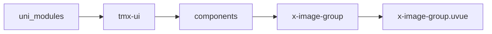
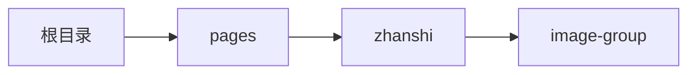

# 图集 xImageGroup
-------
<ViewMobile url="/pages/zhanshi/image-group" />

## 介绍

主要是为了一些需要快速图片排版集的展示，比如评论图集，详情列表图集等，快速开发时使用。方便快捷。

## 平台兼容

| Harmony | H5 | andriod | IOS | 小程序 | UTS | UNIAPP-X SDK | version |
| --- | --- | --- | --- | --- | --- | --- | --- |
| ☑ | ☑ | ☑️ | ☑️ | ☑️ | ☑️ | 4.76+ | 1.1.18 |


## 文件路径

``` ts

@/uni_modules/tmx-ui/components/x-image-group/x-image-group.uvue
```



## 使用

``` ts

<x-image-group></x-image-group>
```

## Props 属性

| 名称 | 说明 | 类型 | 默认值 |
| ------ | ---- | ---- | ---- |
| list | `图片列表`<br>`只要包含有url字段即可。`<br>`label需要在图片显示的文本字段，如果没有不要出现此字段`<br>`如果提供了temp缩略图，会优先展示temp字段，预览时采用url原图`<br>`{url:string,label?:string,temp?:string}`<br> | `Array` | `():UTSJSONObject[] => [] as UTSJSONObject[]` |
| model | `显示的模式见：https://doc.dcloud.net.cn/uni-app-x/component/image.html`<br> | `string` | `"scaleToFill"` |
| height | `图片高,不要使用auto，%，`<br> | `string` | `"100"` |
| width | `图片宽,不要使用auto，可以%值`<br> | `string` | `"33.33%"` |
| gutter | `间隙`<br> | `string` | `"2"` |
| labelModel | `inset表示文本在图片上`<br>`ouuter表示文本在正文展示`<br>`不要动态修改`<br> | `union` | `"inset"` |
| labelFontSize | `如果有文字显示文字的大小`<br> | `string` | `"14"` |
| labelFontColor | `如果有文字，显示文字的颜色`<br> | `string` | `"white"` |
| darkLabelFontColor | `如果有文字，显示文字的颜色，暗黑时为空时取白`<br> | `string` | `""` |
| preview | `是否预览图片`<br> | `boolean` | `true` |
| round | `圆角`<br> | `string` | `"0"` |
| maxCount | `最大显示数量,-1不限制全部展示`<br> | `number` | `-1` |


## Events 事件

| 名称 | 参数 | 说明 |
| ------ | ---- | ---- |
| click | `item: mixed` | 图片项目被点击 |


## Slots 插槽

| 名称 | 说明 | 数据 |
| ------ | ---- | ---- |
| default | `当前设置了maxCount限制显示数量时，且list数量大于maxCount会显示更多数量，如果要自定义，请通过插槽改成你的布局。` | - |


## Ref 方法

| 名称 | 参数 | 返回值 | 说明 |
| ------ | ---- | ---- | ---- |


## 示例文件路径

``` json

/pages/zhanshi/image-group
```



## 示例源码

::: details uvue

<<< ../../../../pages/zhanshi/image-group.uvue{vue}

:::

