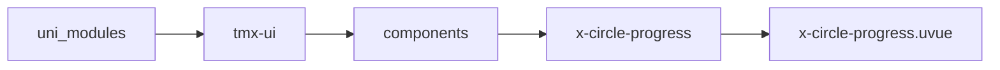
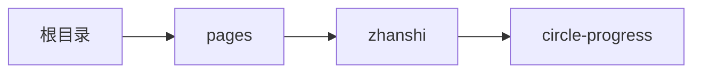

# 圆形进度环 xCircleProgress
-------
<ViewMobile url="/pages/zhanshi/circle-progress" />

## 介绍

样式灵活多变。

## 平台兼容

| Harmony | H5 | andriod | IOS | 小程序 | UTS | UNIAPP-X SDK | version |
| --- | --- | --- | --- | --- | --- | --- | --- |
| ☑ | ☑ | ☑️ | ☑️ | ☑️ | ☑️ | 4.76+ | 1.1.18 |


## 文件路径

``` ts

@/uni_modules/tmx-ui/components/x-circle-progress/x-circle-progress.uvue
```



## 使用

``` ts

<x-circle-progress></x-circle-progress>
```

## Props 属性

| 名称 | 说明 | 类型 | 默认值 |
| ------ | ---- | ---- | ---- |
| size | `可以是px,rpx,纯数字符串。默认以rpx为单位。`<br> | `string` | `"60"` |
| lineWidth | `可以是px,rpx,纯数字符串。默认以rpx为单位。`<br> | `string` | `"3"` |
| startAngle | `起始角度，默认是0，正上方顺时针`<br> | `number` | `0` |
| color | `圆环背景颜色,暗黑时取inputDarkColor`<br> | `string` | `"info"` |
| activeColor | `当前激活的进度颜色，空值读取全局值。`<br> | `string` | `""` |
| modelValue | `当前的值,以百分比为值0-100`<br>`等同v-model=""`<br>`您直接:model-value="xx"也是一样可以改变值。`<br> | `number` | `30` |
| labelFontSize | `中间文本字号`<br> | `string` | `"16"` |
| labelUnit | `数字的单位。`<br> | `string` | `"%"` |
| showLabel | `是否显示中间文本。`<br> | `boolean` | `false` |
| labelColor | `中间文本的颜色。`<br> | `string` | `"#333333"` |
| darkLabelColor | `中间文本的暗黑颜色。空值是取白色`<br> | `string` | `""` |
| duration | `进度条动画的时间,单位ms。`<br>`请不要设置的过慢，否则会有停顿感。`<br> | `number` | `300` |
| linearColor | `渐变背景，使用使用正经的background-image请查阅官方文档,例：'linear-gradient(to bottom,red,green)'`<br>`仅支持小程序和web，app不支持（原因 是canvas对渐变色的动画频繁绘制及canvas性能不行，app不是采用canvas，而是采用原生view绘制所以性能强）`<br> | `string` | `""` |


## Events 事件

| 名称 | 参数 | 说明 |
| ------ | ---- | ---- |


## Slots 插槽

| 名称 | 说明 | 数据 |
| ------ | ---- | ---- |
| default | `默认文本插槽` | current: number<br> |


## Ref 方法

| 名称 | 参数 | 返回值 | 说明 |
| ------ | ---- | ---- | ---- |


## 示例文件路径

``` json

/pages/zhanshi/circle-progress
```



## 示例源码

::: details uvue

<<< ../../../../pages/zhanshi/circle-progress.uvue{vue}

:::

