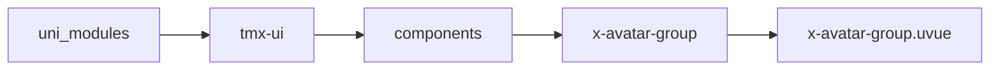
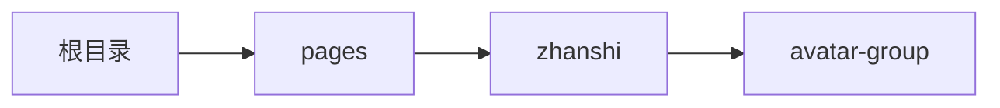

# 头像组 xAvatarGroup
-------
<ViewMobile url="/pages/zhanshi/avatar-group" />

## 介绍

平铺和堆叠方式。如果想要单头像建议使用：xSheet+xImage配合，+xBadge达到效果，因此我不再提供单头像组件，没有意义。

## 平台兼容

| Harmony | H5 | andriod | IOS | 小程序 | UTS | UNIAPP-X SDK | version |
| --- | --- | --- | --- | --- | --- | --- | --- |
| ☑ | ☑ | ☑️ | ☑️ | ☑️ | ☑️ | 4.76+ | 1.1.18 |


## 文件路径

``` ts

@/uni_modules/tmx-ui/components/x-avatar-group/x-avatar-group.uvue
```



## 使用

``` ts

<x-avatar-group></x-avatar-group>
```

## Props 属性

| 名称 | 说明 | 类型 | 默认值 |
| ------ | ---- | ---- | ---- |
| list | `头像列表,也可以是文本数组，也可以是空字符串数组`<br> | `string[]` | `() : string[] => [] as string[]` |
| size | `不允许使用auto,%只能数字或者带单位的数字2px,2rpx这种`<br> | `string` | `'32'` |
| maxCount | `最多显示几个头像。`<br> | `number` | `5` |
| round | `圆角`<br> | `string` | `'16'` |
| gutter | `平铺或者堆叠时的间隙或者前推差值。`<br>`不允许使用auto,%只能数字或者带单位的数字2px,2rpx这种`<br> | `string` | `'16'` |
| model | `显示类型见：`<br>`https://doc.dcloud.net.cn/uni-app-x/component/image.html#%E5%B1%9E%E6%80%A7`<br> | `string` | `"scaleToFill"` |
| count | `显示在最后一个时，显示的数字。如果为0取list的长度`<br> | `number` | `0` |
| showCount | `是否显示最后一个数字头像`<br> | `boolean` | `true` |
| flat | `是否平铺，如果否就是堆叠。是就是正常排列。`<br> | `boolean` | `false` |
| bgColor | `如果为文本头像时的背景`<br> | `string` | `"#f5f5f5"` |
| darkBgColor | `如果为文本头像时的暗黑背景`<br>`空时默认取inputDarkBgcolor`<br> | `string` | `""` |
| fontColor | `如果为文本头像时的文字颜色`<br> | `string` | `"#a6a6a6"` |
| darkFontColor | `如果为文本头像时的暗黑背景`<br>`空时默认取inputDarkBgcolor`<br> | `string` | `"#ffffff"` |
| fontSize | `字号`<br> | `string` | `"14"` |
| randomBgColor | `文本头像时，是否随机背景色`<br> | `boolean` | `false` |
| placeIcon | `如果当图片或者文本为空时的图片占位符`<br>`可以是图片地址或者图标名称`<br> | `string` | `'user-3-fill'` |


## Events 事件

| 名称 | 参数 | 说明 |
| ------ | ---- | ---- |
| click | `index: numbersrc: string` | 头像被点击时 |
| moreClick | `-` | 最后一个数字头像more被点击时 |


## Slots 插槽

| 名称 | 说明 | 数据 |
| ------ | ---- | ---- |
| more | `more更多插槽，如果使用了这个插槽moreClick事件会丢失，请自己写在自己的布局上。` | - |


## Ref 方法

| 名称 | 参数 | 返回值 | 说明 |
| ------ | ---- | ---- | ---- |


## 示例文件路径

``` json

/pages/zhanshi/avatar-group
```



## 示例源码

::: details uvue

<<< ../../../../pages/zhanshi/avatar-group.uvue{vue}

:::

