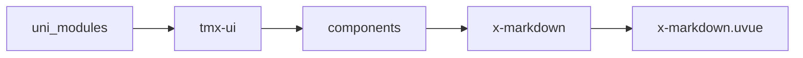

# 富文本 xMarkdown
-------
<ViewMobile url="/pages/zhanshi/markdown" />

## 介绍

这是一个预览markdown的组件。当前支持markdown:表格，及数学公式的展示。
【小程序端请注意】从1.1.14开始支持LaTex数学公式，但要注意数学公式暂时不要混合在表格内，会造成表格断列，样式异常。
【组件目录内】有一个fonts.zip字体压缩包，请上传到你自己的服务器，并打开katex.min.css，把里面的字体链接换成你的字体连接，如果不换可能我服务器一关你就用不了了。
传递正常markdown或者html内容即可,已经支持了暗黑适配，请自行配置样式。
预览md:支持流式解析,支持动态解析内容.方便大家对话用.同时也支持了动态高,自动适配.
同时也放开了内容复制(但会导致安卓(截止sdk4.53)页面滚动不了,需要你们自己解决:给这个组件盖个view屏蔽webview的事件,这是sdk底层问题,我修复不了.)
1.1.10废弃了函数:getMarkdown
所有平台的样式已经重置为none,你需要通过属性nodeStyle来设置默认样式.

## 平台兼容

| Harmony | H5 | andriod | IOS | 小程序 | UTS | UNIAPP-X SDK | version |
| --- | --- | --- | --- | --- | --- | --- | --- |
| ☑ | ☑ | ☑️ | ☑️ | ☑️ | ☑️ | 4.76+ | 1.1.18 |


## 文件路径

``` ts

@/uni_modules/tmx-ui/components/x-markdown/x-markdown.uvue
```



## 使用

``` ts

<x-markdown></x-markdown>
```

## Props 属性

| 名称 | 说明 | 类型 | 默认值 |
| ------ | ---- | ---- | ---- |
| width | `窗口宽`<br> | `string` | `'auto'` |
| height | `窗口高,auto时会自动适配高.`<br> | `string` | `'auto'` |
| value | `需要渲染的markdow或者html内容。`<br> | `string` | `""` |
| isHtml | `是否启用纯html渲染。如果你的内容含有特殊字符比如:%,^&%这种不要出现在里面`<br>`此时你启用isHtml会经过数据处理直接跳过插件,直接赋值内容到html.就不要启用Markdown了.`<br> | `boolean` | `false` |
| nodeStyle | `富文本的style样式,不可以动态更改.`<br>`为了对齐所有端,默认已经把所有平台的样式删除.因此你可以自己设置默认样式来对齐所有平台.`<br> | `string` | `"line-height:1.6;color:#000"` |
| nodeDarkStyle | `同上，暗黑时的样式.`<br> | `string` | `"line-height:1.6;color:#fff"` |


## Events 事件

| 名称 | 参数 | 说明 |
| ------ | ---- | ---- |
| tagClick | `undefined` | 特定的a,img标签被点击触发,小程序不支持,其它平台支持. |
| init | `-` | 文档插件加载初始完成触发，这里响应完成后，你才要吧更新和修改数据。否则会报：未初始化。 |
| getValue | `-` | 需要通过ref函数调用getHtml才会触发此函数 |


## Slots 插槽

| 名称 | 说明 | 数据 |
| ------ | ---- | ---- |


## Ref 方法

| 名称 | 参数 | 返回值 | 说明 |
| ------ | ---- | ---- | ---- |
| getHtml | - | `-` | 获取html内容。注意本函数不会返回内容，你要通过事件getValue得到html内容. |


## 示例文件路径

``` json

/pages/zhanshi/markdown
```


## 示例源码

::: details uvue

<<< ../../../../pages/zhanshi/markdown.uvue{vue}

:::

