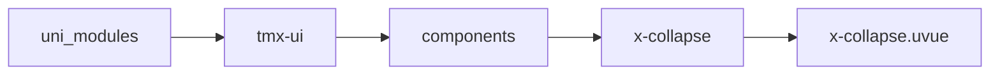
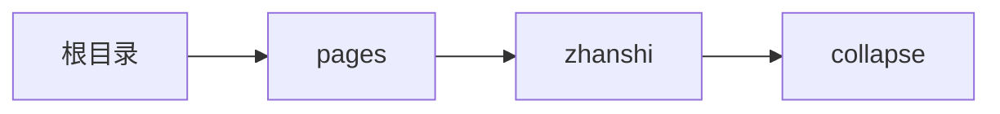

# 折叠面板 xCollapse
-------
<ViewMobile url="/pages/zhanshi/collapse" />

## 介绍

可单，可多开,内部只可放置x-collapse-item直接子节点组件，为了避免重复计算和性能x-collapse-item不能通过响应式修改内容。如果确实需要请通过刷新key解决

## 平台兼容

| Harmony | H5 | andriod | IOS | 小程序 | UTS | UNIAPP-X SDK | version |
| --- | --- | --- | --- | --- | --- | --- | --- |
| ☑ | ☑ | ☑️ | ☑️ | ☑️ | ☑️ | 4.76+ | 1.1.18 |


## 文件路径

``` ts

@/uni_modules/tmx-ui/components/x-collapse/x-collapse.uvue
```



## 使用

``` ts

<x-collapse></x-collapse>
```

## Props 属性

| 名称 | 说明 | 类型 | 默认值 |
| ------ | ---- | ---- | ---- |
| modelValue | `当前打开的组。可v-model`<br> | `string[]` | `() : string[] => [] as string[]` |
| multiple | `是否允许打开多个。`<br> | `boolean` | `true` |


## Events 事件

| 名称 | 参数 | 说明 |
| ------ | ---- | ---- |
| change | `value: String[]` | 变换时触发 |
| update:modelValue | `-` | - |


## Slots 插槽

| 名称 | 说明 | 数据 |
| ------ | ---- | ---- |
| default | `默认插槽，仅可放置x-collapse-item子节点` | - |


## Ref 方法

| 名称 | 参数 | 返回值 | 说明 |
| ------ | ---- | ---- | ---- |
| addItem | - | `-` | - |
| delItem | - | `-` | - |
| addChange | - | `-` | - |


## 示例文件路径

``` json

/pages/zhanshi/collapse
```



## 示例源码

::: details uvue

<<< ../../../../pages/zhanshi/collapse.uvue{vue}

:::

