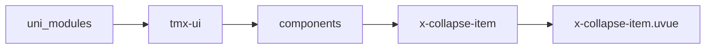
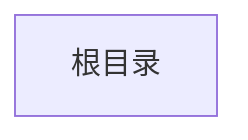

# 折叠面板子组件 xCollapseItem
-------
<ViewMobile url="" />

## 介绍

可单，可多开,只可放置在x-collapse直接子节点组件,为了避免重复计算和性能x-collapse-item不能通过响应式修改内容。如果确实需要请通过刷新key解决

## 平台兼容

| Harmony | H5 | andriod | IOS | 小程序 | UTS | UNIAPP-X SDK | version |
| --- | --- | --- | --- | --- | --- | --- | --- |
| ☑ | ☑ | ☑️ | ☑️ | ☑️ | ☑️ | 4.76+ | 1.1.18 |


## 文件路径

``` ts

@/uni_modules/tmx-ui/components/x-collapse-item/x-collapse-item.uvue
```



## 使用

``` ts

<x-collapse-item></x-collapse-item>
```

## Props 属性

| 名称 | 说明 | 类型 | 默认值 |
| ------ | ---- | ---- | ---- |
| name | `唯一标识`<br> | `string` | `""` |
| showBottomLine | `是否显示底部边线`<br> | `boolean` | `true` |
| disabled | `是否禁用`<br> | `boolean` | `false` |
| titleFontSize | `标题大小`<br> | `string` | `'16px'` |
| titleColor | `标题颜色`<br> | `string` | `'#333333'` |
| darkTitleColor | `暗黑时的标题颜色，如果不填写取白`<br> | `string` | `''` |
| activeColor | `激活时的颜色，空值读取全局值。`<br> | `string` | `''` |
| color | `背景`<br> | `string` | `'white'` |
| darkColor | `暗黑时的背景，如果不填写默认取sheetDarkColor`<br> | `string` | `''` |
| leftIcon | `左边图标`<br> | `string` | `''` |
| title | `标题`<br> | `string` | `''` |
| titleHeight | `标题高度`<br> | `string` | `'55'` |
| titleLines | `标题最多显示几行出现省略号`<br> | `number` | `1` |
| custom | `是否开启自定整个cell内容，如果你的整个内容要自定义实现，且复杂，请`<br>`设置为true后并在插槽内#custom写你的布局内容。`<br> | `boolean` | `false` |


## Events 事件

| 名称 | 参数 | 说明 |
| ------ | ---- | ---- |
| click | `name: stringopened: boolean` | 点击组件标题时触发 |


## Slots 插槽

| 名称 | 说明 | 数据 |
| ------ | ---- | ---- |
| left | `左边插槽` | status: boolean<br> |
| title | `标题插槽，如果你要完全自定标题样式请在此插槽内布局` | status: boolean<br> |
| right | `右边插槽` | status: boolean<br> |
| custom | `自定义内容` | - |
| default | `默认内容插槽。` | - |


## Ref 方法

| 名称 | 参数 | 返回值 | 说明 |
| ------ | ---- | ---- | ---- |


## 示例文件路径

``` json


```



## 示例源码

::: details uvue


:::

