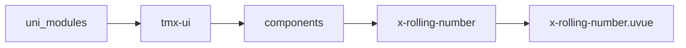

# 数字翻滚 xRollingNumber
-------
<ViewMobile url="/pages/zhanshi/rolling-number" />

## 介绍

是否小数点，取决与你的的endVal目标值，如果它带小数点，那动画也是相应带小数点。

## 平台兼容

| Harmony | H5 | andriod | IOS | 小程序 | UTS | UNIAPP-X SDK | version |
| --- | --- | --- | --- | --- | --- | --- | --- |
| ☑ | ☑ | ☑️ | ☑️ | ☑️ | ☑️ | 4.76+ | 1.1.18 |


## 文件路径

``` ts

@/uni_modules/tmx-ui/components/x-rolling-number/x-rolling-number.uvue
```



## 使用

``` ts

<x-rolling-number></x-rolling-number>
```

## Props 属性

| 名称 | 说明 | 类型 | 默认值 |
| ------ | ---- | ---- | ---- |
| fontSize | `文字大小`<br> | `string` | `"32"` |
| fontColor | `文字颜色`<br> | `string` | `"black"` |
| fontStyle | ``<br> | `string` | `''` |
| darkFontColor | `暗黑时的文字颜色，如果为空取白`<br> | `string` | `""` |
| startVal | `起始值`<br> | `number` | `0` |
| endVal | `目标值（当前需要显示的值）`<br> | `number` | `0` |
| duration | `动画速率。控制翻滚动的动画效果。`<br> | `number` | `400` |
| easing | `缓动函数类型`<br> | `string` | `"easeIn"` |
| useGrouping | `是否显示千分位分隔符`<br> | `boolean` | `false` |
| decimals | `小数位数`<br> | `number` | `-1` |
| prefix | `前缀符号（如货币符号）`<br> | `string` | `""` |
| suffix | `后缀符号（如单位）`<br> | `string` | `""` |
| enableAnimation | `是否启用动画`<br> | `boolean` | `true` |


## Events 事件

| 名称 | 参数 | 说明 |
| ------ | ---- | ---- |
| animationStart | `-` | 动画开始时触发 |
| animationComplete | `-` | 动画完成时触发 |
| animationPause | `-` | 动画暂停时触发 |
| animationResume | `-` | 动画恢复时触发 |
| animationStop | `-` | 动画停止时触发 |
| valueChange | `-` | 数值变化时触发 |


## Slots 插槽

| 名称 | 说明 | 数据 |
| ------ | ---- | ---- |
| default | `默认插槽` | value: string<br>value: string<br>formattedValue: string<br>formattedValue: string<br> |


## Ref 方法

| 名称 | 参数 | 返回值 | 说明 |
| ------ | ---- | ---- | ---- |
| play | - | `-` | 播放动画 * |
| pause | - | `-` | 暂停动画 * |
| resume | - | `-` | 恢复动画 * |
| stop | - | `-` | 停止动画 * |
| reset | - | `-` | 重置到起始值 * |
| isAnimating | - | `-` | 是否正在动画中 * |
| getValue | - | `-` | 获取当前值 * |
| getFormattedValue | - | `-` | 获取格式化后的值 * |


## 示例文件路径

``` json

/pages/zhanshi/rolling-number
```


## 示例源码

::: details uvue

<<< ../../../../pages/zhanshi/rolling-number.uvue{vue}

:::

