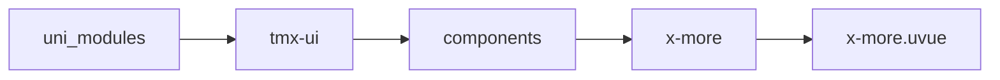
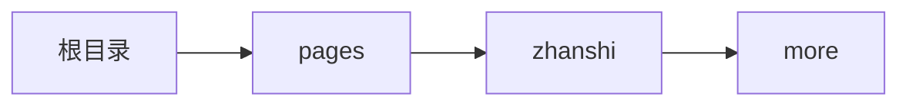

# 查看更多 xMore
-------
<ViewMobile url="/pages/zhanshi/more" />

## 介绍

让内容超过指定高时自动隐藏内容.

## 平台兼容

| Harmony | H5 | andriod | IOS | 小程序 | UTS | UNIAPP-X SDK | version |
| --- | --- | --- | --- | --- | --- | --- | --- |
| ☑ | ☑ | ☑️ | ☑️ | ☑️ | ☑️ | 4.76+ | 1.1.18 |


## 文件路径

``` ts

@/uni_modules/tmx-ui/components/x-more/x-more.uvue
```



## 使用

``` ts

<x-more></x-more>
```

## Props 属性

| 名称 | 说明 | 类型 | 默认值 |
| ------ | ---- | ---- | ---- |
| width | `组件宽度`<br> | `string` | `"auto"` |
| height | `被关闭时的高度。`<br> | `string` | `"60"` |
| actionGap | `操作操作栏区域上下间隙高度。`<br> | `string` | `"10"` |
| modelValue | `当前打开的状态`<br> | `boolean` | `false` |
| activeColor | `激活后的文本色,默认是读取全局色`<br> | `string` | `""` |
| unActiveColor | `未激活后的文本色`<br> | `string` | `"#a6a6a6"` |
| text | `打开和关闭状态的文本`<br>`"展开更多", "收起更多"`<br> | `Array` | `() => [] as string[]` |
| maskBgColor | `遮罩的渐变的背景色`<br> | `Array` | `() => ['rgba(255, 255, 255, 1)', 'rgba(255, 255, 255, 0.3)']` |
| darkMaskBgColor | `暗黑时遮罩的渐变的背景色`<br> | `Array` | `() => ['rgba(24, 24, 24, 1.0)', 'rgba(24, 24, 24, 0.3)']` |
| disabled | `是否禁用展开。`<br> | `boolean` | `false` |
| showMoreBtn | `是否显示开启和关闭按钮,`<br>`因为各个手机屏幕可能不一样,可能会根据行数自行决定是否`<br>`要显示展开和关闭按钮,请通过此自行判断.`<br> | `boolean` | `true` |


## Events 事件

| 名称 | 参数 | 说明 |
| ------ | ---- | ---- |
| change | `opened:  boolean ` | 状态切换时变换 |
| click | `opened: boolean` | 点击展开的按钮时触发 |
| update:modelValue | `-` | - |


## Slots 插槽

| 名称 | 说明 | 数据 |
| ------ | ---- | ---- |
| default | `默认插槽 ` | isOpened: boolean<br> |
| action | `底部操作栏插槽 ` | isOpened: boolean<br> |


## Ref 方法

| 名称 | 参数 | 返回值 | 说明 |
| ------ | ---- | ---- | ---- |


## 示例文件路径

``` json

/pages/zhanshi/more
```



## 示例源码

::: details uvue

<<< ../../../../pages/zhanshi/more.uvue{vue}

:::

