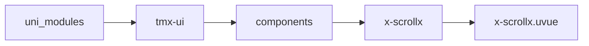

# 横向滚动 xScrollx
-------
<ViewMobile url="/pages/zhanshi/scrollx" />

## 介绍

需要明确内部宽，否则无法左右导航滚动。

## 平台兼容

| Harmony | H5 | andriod | IOS | 小程序 | UTS | UNIAPP-X SDK | version |
| --- | --- | --- | --- | --- | --- | --- | --- |
| ☑ | ☑ | ☑️ | ☑️ | ☑️ | ☑️ | 4.76+ | 1.1.18 |


## 文件路径

``` ts

@/uni_modules/tmx-ui/components/x-scrollx/x-scrollx.uvue
```



## 使用

``` ts

<x-scrollx></x-scrollx>
```

## Props 属性

| 名称 | 说明 | 类型 | 默认值 |
| ------ | ---- | ---- | ---- |
| width | `宽，不能设置为auto,需要一个具体的宽度值`<br>`否则无法左右滚动。`<br> | `string` | `'100%'` |
| height | `高`<br> | `string` | `'auto'` |
| scrollbarWidth | `下面横向小条宽,px单位`<br> | `number` | `100` |
| scrollbarHeight | `下面横向小条高,px单位`<br> | `number` | `6` |
| showScrollBar | `是否显示底部横线指示`<br> | `boolean` | `true` |
| scrollPosBarWidth | `内部小指示条的宽,px单位`<br> | `number` | `20` |
| scrollPosBgColor | `下面滚动指示条的轨道背景`<br> | `string` | `"#f3f5f8"` |
| darkScrollPosBgColor | `下面滚动指示条的轨道暗黑背景`<br>`不填充的话取输入框的暗黑背景`<br> | `string` | `""` |
| scrollPosColor | `下面滚动指示条的活动背景`<br>`不填写的话取全局的color`<br> | `string` | `""` |
| marginTop | `顶部的距离。`<br> | `string` | `"15"` |


## Events 事件

| 名称 | 参数 | 说明 |
| ------ | ---- | ---- |
| scroll | `evt: UniScrollEvent` | 滚动时触发 |


## Slots 插槽

| 名称 | 说明 | 数据 |
| ------ | ---- | ---- |
| default | `当前滚指示内部的小条的位置` | - |


## Ref 方法

| 名称 | 参数 | 返回值 | 说明 |
| ------ | ---- | ---- | ---- |


## 示例文件路径

``` json

/pages/zhanshi/scrollx
```


## 示例源码

::: details uvue

<<< ../../../../pages/zhanshi/scrollx.uvue{vue}

:::

