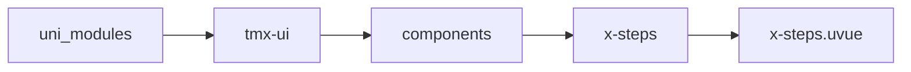
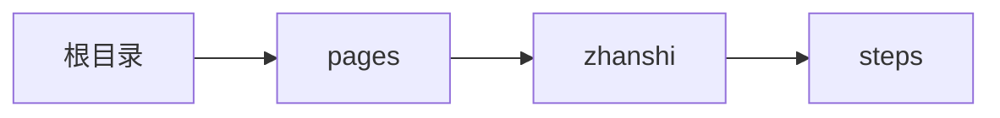

# 步骤条 xSteps
-------
<ViewMobile url="/pages/zhanshi/steps" />

## 介绍

标签内仅可放置其直接子节点：x-steps-item

## 平台兼容

| Harmony | H5 | andriod | IOS | 小程序 | UTS | UNIAPP-X SDK | version |
| --- | --- | --- | --- | --- | --- | --- | --- |
| ☑ | ☑ | ☑️ | ☑️ | ☑️ | ☑️ | 4.76+ | 1.1.18 |


## 文件路径

``` ts

@/uni_modules/tmx-ui/components/x-steps/x-steps.uvue
```



## 使用

``` ts

<x-steps></x-steps>
```

## Props 属性

| 名称 | 说明 | 类型 | 默认值 |
| ------ | ---- | ---- | ---- |
| modelValue | ``<br> | `number` | `0` |
| icon | `默认图标，请在子级上动态修改`<br> | `string` | `"checkbox-blank-circle-fill"` |
| activeIcon | `激活时的图标，请在子级上动态修改`<br> | `string` | `"checkbox-circle-fill"` |
| iconSize | `图标大小,不可动态修改，请在子级上动态修改`<br> | `string` | `"14"` |
| labelSize | `标题大小，请在子级上动态修改`<br> | `string` | `"14"` |
| descSize | `下面的小文字介绍大小`<br> | `string` | `"11"` |
| color | `未选中时的标题颜色，请在子级上动态修改`<br> | `string` | `"#333333"` |
| activeColor | `激活时的颜色，默认空值取全局主题色。，请在子级上动态修改`<br> | `string` | `""` |
| vertical | `是否是竖向`<br> | `boolean` | `false` |
| reverse | `是否反转,不是内容反转,是状态反向.`<br> | `boolean` | `false` |
| disabled | `是否禁用交互，即不可点击项目来切换进度。`<br> | `boolean` | `true` |


## Events 事件

| 名称 | 参数 | 说明 |
| ------ | ---- | ---- |
| change | `index: number` | 变换时触发 |
| update:modelValue | `-` | 等同v-model="" |


## Slots 插槽

| 名称 | 说明 | 数据 |
| ------ | ---- | ---- |
| default | `默认插槽，仅可放置其直接子节点：x-steps-item` | - |


## Ref 方法

| 名称 | 参数 | 返回值 | 说明 |
| ------ | ---- | ---- | ---- |


## 示例文件路径

``` json

/pages/zhanshi/steps
```



## 示例源码

::: details uvue

<<< ../../../../pages/zhanshi/steps.uvue{vue}

:::

