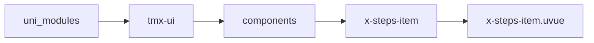
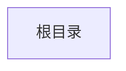

# 步骤条子组件 xStepsItem
-------
<ViewMobile url="" />

## 介绍

仅可直接放置在x-steps标签当作直接子接点

## 平台兼容

| Harmony | H5 | andriod | IOS | 小程序 | UTS | UNIAPP-X SDK | version |
| --- | --- | --- | --- | --- | --- | --- | --- |
| ☑ | ☑ | ☑️ | ☑️ | ☑️ | ☑️ | 4.76+ | 1.1.18 |


## 文件路径

``` ts

@/uni_modules/tmx-ui/components/x-steps-item/x-steps-item.uvue
```



## 使用

``` ts

<x-steps-item></x-steps-item>
```

## Props 属性

| 名称 | 说明 | 类型 | 默认值 |
| ------ | ---- | ---- | ---- |
| label | `标题`<br> | `string` | `""` |
| desc | `辅助信息`<br> | `string` | `""` |
| color | `未选中时的标题颜色`<br> | `string` | `""` |
| activeColor | `激活时的颜色，默认空值取全局主题色。`<br> | `string` | `""` |
| icon | `默认图标，空值时取父级设置的图标`<br> | `string` | `""` |
| activeIcon | `激活时的图标，空值时取父级设置的图标`<br> | `string` | `""` |
| iconSize | `图标大小，空值时取父级`<br> | `string` | `""` |
| labelSize | `标题大小，空值时取父级`<br> | `string` | `""` |
| descSize | `下面的小文字介绍大小`<br> | `string` | `""` |


## Events 事件

| 名称 | 参数 | 说明 |
| ------ | ---- | ---- |
| click | `-` | 点击时触发 |


## Slots 插槽

| 名称 | 说明 | 数据 |
| ------ | ---- | ---- |
| default | `默认的文本节点插槽` | active: boolean<br> |


## Ref 方法

| 名称 | 参数 | 返回值 | 说明 |
| ------ | ---- | ---- | ---- |
| setList | - | `-` | - |
| setActive | - | `-` | - |


## 示例文件路径

``` json


```



## 示例源码

::: details uvue


:::

