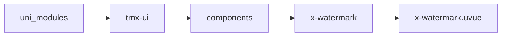
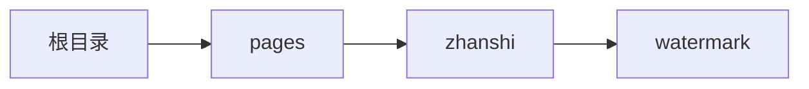

# 水印 xWatermark
-------
<ViewMobile url="/pages/zhanshi/watermark" />

## 介绍

适合需要保密，版权的页面使用，可自行调整透明度，颜色值等，方便打标签。

## 平台兼容

| Harmony | H5 | andriod | IOS | 小程序 | UTS | UNIAPP-X SDK | version |
| --- | --- | --- | --- | --- | --- | --- | --- |
| ☑ | ☑ | ☑️ | ☑️ | ☑️ | ☑️ | 4.76+ | 1.1.18 |


## 文件路径

``` ts

@/uni_modules/tmx-ui/components/x-watermark/x-watermark.uvue
```



## 使用

``` ts

<x-watermark></x-watermark>
```

## Props 属性

| 名称 | 说明 | 类型 | 默认值 |
| ------ | ---- | ---- | ---- |
| label | `水印文字`<br> | `string` | `"XUI DESIGN"` |
| color | `水印颜色`<br> | `string` | `"rgba(0,0,0,0.05)"` |
| darkColor | `暗黑时的水印颜色`<br> | `string` | `"rgba(255,255,255,0.05)"` |
| fontSize | `文字大小`<br> | `string` | `"18"` |
| gap | `渲染的水印之间的间隙，单位px`<br> | `number` | `40` |


## Events 事件

| 名称 | 参数 | 说明 |
| ------ | ---- | ---- |


## Slots 插槽

| 名称 | 说明 | 数据 |
| ------ | ---- | ---- |


## Ref 方法

| 名称 | 参数 | 返回值 | 说明 |
| ------ | ---- | ---- | ---- |


## 示例文件路径

``` json

/pages/zhanshi/watermark
```



## 示例源码

::: details uvue

<<< ../../../../pages/zhanshi/watermark.uvue{vue}

:::

