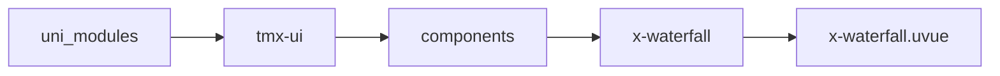
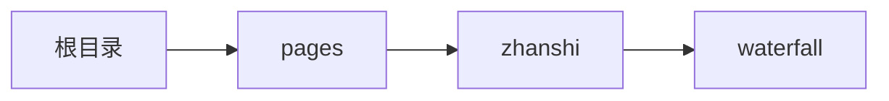

# 瀑布流 xWaterfall
-------
<ViewMobile url="/pages/zhanshi/waterfall" />

## 介绍

可以通过columnu来控制排版列数，默认是2列排版。可以无限加载不卡,全异步流加载.使用时请参考demo布局,已精心为你规划如何提高性能.

## 平台兼容

| Harmony | H5 | andriod | IOS | 小程序 | UTS | UNIAPP-X SDK | version |
| --- | --- | --- | --- | --- | --- | --- | --- |
| ☑ | ☑ | ☑️ | ☑️ | ☑️ | ☑️ | 4.76+ | 1.1.18 |


## 文件路径

``` ts

@/uni_modules/tmx-ui/components/x-waterfall/x-waterfall.uvue
```



## 使用

``` ts

<x-waterfall></x-waterfall>
```

## Props 属性

| 名称 | 说明 | 类型 | 默认值 |
| ------ | ---- | ---- | ---- |
| column | `瀑布流的列数`<br>`不可动态动态更改。`<br> | `number` | `2` |
| listCount | `用来刷新数据的，你可以通过你的外面list.length来传递进来`<br>`比如为0时，自动清空瀑布流数据。`<br> | `number` | `0` |
| gutter | `间距,单位不能为%比，可以是数字字符，带rpx,px等单位`<br>`默认的数字符单位是全局的unit单位。`<br> | `string` | `'8'` |
| isResize | `是否响应尺寸监测。设置为false可以关闭`<br>`关闭后能增加性能。`<br> | `boolean` | `false` |
| disabledScroll | ``<br> | `boolean` | `false` |


## Events 事件

| 名称 | 参数 | 说明 |
| ------ | ---- | ---- |
| bottom | `-` | - |
| top | `-` | - |


## Slots 插槽

| 名称 | 说明 | 数据 |
| ------ | ---- | ---- |
| header | `-` | - |
| default | `只能放置直接子节点x-waterfall-item` | - |


## Ref 方法

| 名称 | 参数 | 返回值 | 说明 |
| ------ | ---- | ---- | ---- |
| pushChild | - | `-` | - |
| notifyRendered | - | `-` | - |
| removeChild | - | `-` | - |


## 示例文件路径

``` json

/pages/zhanshi/waterfall
```



## 示例源码

::: details uvue

<<< ../../../../pages/zhanshi/waterfall.uvue{vue}

:::

