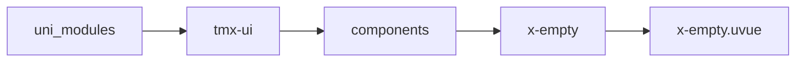
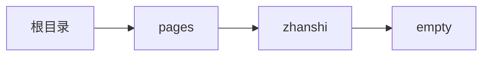

# 空状态 xEmpty
-------
<ViewMobile url="/pages/zhanshi/empty" />

## 介绍

主要用于列表加载页面或者空状态页面时使用。

## 平台兼容

| Harmony | H5 | andriod | IOS | 小程序 | UTS | UNIAPP-X SDK | version |
| --- | --- | --- | --- | --- | --- | --- | --- |
| ☑ | ☑ | ☑️ | ☑️ | ☑️ | ☑️ | 4.76+ | 1.1.18 |


## 文件路径

``` ts

@/uni_modules/tmx-ui/components/x-empty/x-empty.uvue
```



## 使用

``` ts

<x-empty></x-empty>
```

## Props 属性

| 名称 | 说明 | 类型 | 默认值 |
| ------ | ---- | ---- | ---- |
| loading | `加载状态`<br> | `boolean` | `true` |
| empty | `是否为空`<br> | `boolean` | `false` |
| error | `错误状态`<br> | `boolean` | `false` |
| more | `是否有更多数据状态`<br> | `boolean` | `false` |
| moreLabel | `没有数据时的提示，用于加载更多数据时`<br>`,没有更多数据啦`<br> | `string` | `""` |
| errorLabel | `列表加载出错时,出错啦~`<br> | `string` | `""` |
| btnLabel | `按钮文本,点击重试`<br> | `string` | `""` |
| btnColor | `按钮颜色，默认取全局值`<br> | `string` | `""` |
| btnTextColor | `按钮文本颜色，默认自动`<br> | `string` | `""` |
| title | `空或者加载出错时的标语,当前没有数据`<br> | `string` | `""` |
| src | `图片路径`<br> | `string` | `"/static/tmui4xLibs/static/empty.png"` |
| showBtn | `是否显示重试按钮`<br> | `boolean` | `true` |


## Events 事件

| 名称 | 参数 | 说明 |
| ------ | ---- | ---- |
| click | `-` | 刷新按钮被点击时触发 |


## Slots 插槽

| 名称 | 说明 | 数据 |
| ------ | ---- | ---- |
| default | `按钮位置的插槽` | - |


## Ref 方法

| 名称 | 参数 | 返回值 | 说明 |
| ------ | ---- | ---- | ---- |


## 示例文件路径

``` json

/pages/zhanshi/empty
```



## 示例源码

::: details uvue

<<< ../../../../pages/zhanshi/empty.uvue{vue}

:::

