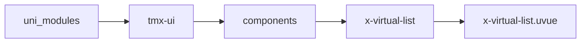

# 虚拟列表 xVirtualList
-------
<ViewMobile url="/pages/zhanshi/virtual-list" />

## 介绍

这是一个超高虚拟列表，无论几万数据都能轻松应对是你列表处理数据的不二之选，集成下拉刷新，触底更新，指定索引位置等。
未来将应于表格，picker等系列组件，作为其它组件的底层存在，极大提高性能。使用时请注意demo示例使用方法。

## 平台兼容

| Harmony | H5 | andriod | IOS | 小程序 | UTS | UNIAPP-X SDK | version |
| --- | --- | --- | --- | --- | --- | --- | --- |
| ☑ | ☑ | ☑️ | ☑️ | ☑️ | ☑️ | 4.76+ | 1.1.18 |


## 文件路径

``` ts

@/uni_modules/tmx-ui/components/x-virtual-list/x-virtual-list.uvue
```



## 使用

``` ts

<x-virtual-list></x-virtual-list>
```

## Props 属性

| 名称 | 说明 | 类型 | 默认值 |
| ------ | ---- | ---- | ---- |
| itemHeight | `项目高度，不可用auto,只能是数字（默认为px),带单位的rpx,px`<br> | `string` | `"50"` |
| viewCount | `渲染显示多少个,它不是最终的渲染数量，是最少数量，因为内部还有个缓存数量`<br> | `number` | `5` |
| list | `数据列表`<br> | `Array` | `() => [] as any[]` |
| bufferSize | `缓冲区大小，在可视区域前后额外渲染的项目数量`<br> | `number` | `4` |
| enableVirtual | `是否启用虚拟滚动`<br> | `boolean` | `true` |
| refresherEnabled | `启用下拉刷新`<br> | `boolean` | `false` |
| pullState | `需要自行管理下拉状态，默认为false,通过事件pull触发设置为true,结束设置为False`<br> | `boolean` | `false` |
| refresherBottomEnabled | `启用触底刷新`<br> | `boolean` | `false` |
| bottomState | `需要自行管理下拉状态，默认为false,通过事件bottom触发设置为true,结束设置为False`<br> | `boolean` | `false` |


## Events 事件

| 名称 | 参数 | 说明 |
| ------ | ---- | ---- |
| scroll | `-` | 滚动事件 |
| pull | `-` | 滚动到顶时触发 |
| bottom | `-` | 触底时触发 |
| rangeChange | `-` | 渲染范围变化时触发 |


## Slots 插槽

| 名称 | 说明 | 数据 |
| ------ | ---- | ---- |
| sticky | `sticky插槽` | - |
| default | `内容插槽你在这里渲染内容` | data: any[]<br>data: number<br>data: number<br>startIndex: any[]<br>startIndex: number<br>startIndex: number<br>endIndex: any[]<br>endIndex: number<br>endIndex: number<br> |
| bottom | `底部插槽` | - |


## Ref 方法

| 名称 | 参数 | 返回值 | 说明 |
| ------ | ---- | ---- | ---- |
| scrollToIndex | - | `-` | 滚动到指定索引 |
| refreshSize | - | `-` | 刷新容器尺寸 |
| resetScroll | - | `-` | 重置滚动位置 |
| getRenderRange | - | `-` | 获取当前渲染范围 |
| getContainerBounds | - | `-` | 获取容器尺寸 |


## 示例文件路径

``` json

/pages/zhanshi/virtual-list
```


## 示例源码

::: details uvue

<<< ../../../../pages/zhanshi/virtual-list.uvue{vue}

:::

