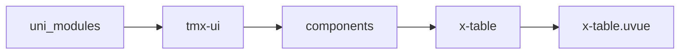
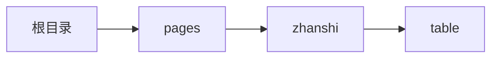

# 表格 xTable
-------
<ViewMobile url="/pages/zhanshi/table" />

## 介绍

格式与antd一样。可以单独设置样式和整体列设置样式。也可以单独设置列宽，项目列宽虽然 可以auto，但数据多的情况下不要用，还是定义具体的百分比或者数字比较快的渲染。
1.具体想控制某一单元格的完全定义，可通过具名指定单元格插槽及行插槽，用于复杂的布局（使用插槽时，不可排序）
在单元格数据中 添加 {merge:{'key字段':{colspan:合并的列数}}}可以让当前单格向右合并下列（被合并的列数据将被隐藏不显示）。
在单元格数据中 添加 {showCheck:boolean},可以单独控制隐藏某一行不参与行选中(前提需要在x-tabale设置属性 :showCheck="true" 开启表格行选中功能)，**行选中功能仅支持没有浮动置顶的数据表格**。
不管是头还是单元格它的style格式是一样的 {style:{key字段:{bgStyle,textStyle,align:'对齐方式:flex-start,center,flex-end'}}}
具体的数据格式见demo页面(web,微信是不支持多表头固定悬浮的，web只支持一个悬浮的（多悬浮下只显示最后一个悬浮，此不是bug，是官方的组件就不支持。以前文档写了但现在官方 文档我没找到，但实际是不支持的）)

## 平台兼容

| Harmony | H5 | andriod | IOS | 小程序 | UTS | UNIAPP-X SDK | version |
| --- | --- | --- | --- | --- | --- | --- | --- |
| ☑ | ☑ | ☑️ | ☑️ | ☑️ | ☑️ | 4.76+ | 1.1.18 |


## 文件路径

``` ts

@/uni_modules/tmx-ui/components/x-table/x-table.uvue
```



## 使用

``` ts

<x-table></x-table>
```

## Props 属性

| 名称 | 说明 | 类型 | 默认值 |
| ------ | ---- | ---- | ---- |
| list | `源数据`<br> | `Array` | `():UTSJSONObject[] => [] as UTSJSONObject[]` |
| columns | `列标题及字段定义`<br> | `Array` | `():xTableColumns[] => [] as xTableColumns[]` |
| height | `容器的高，如果不设定，不会有上下滚动`<br>`而直接从上往下布局。如果数据多建议设置。`<br> | `string` | `"auto"` |
| width | `容器的宽,不可以填写auto。`<br> | `string` | `"100%"` |
| maxHeight | `最大高度`<br> | `string` | `"300"` |
| cellHeight | `单元格的高，不能%`<br>`从1.1.18起允许为auto，或其它值，已经改为最小值，不再固定高，可以大段落自动断行了（早基sdk有bug实现不了目前经测试已无问题）`<br> | `string` | `"44"` |
| cellWidth | `单元格的宽,不填写自动均分`<br>`它是允许任意值auto,%，固定值等`<br>`但我经过我测试auto，会影响原生渲染的速率（不是我影响的是自动布局的速率）`<br> | `string` | `""` |
| fontSize | `单元格的文字大小`<br>`局部的设置会覆盖这里的`<br> | `string` | `"14"` |
| fontColor | `单元格的文字颜色`<br>`局部的设置会覆盖这里的`<br> | `string` | `"#333333"` |
| fontDarkColor | `单元格的暗黑文字颜色`<br>`局部的设置会覆盖这里的`<br> | `string` | `"#dedede"` |
| headerBgColor | `头的背景`<br> | `string` | `"#eeeeee"` |
| darkHeaderBgColor | `暗黑时，如果未设置取inputDarkColor`<br> | `string` | `""` |
| headerFontColor | `头的文字颜色,暗黑时取白`<br> | `string` | `"#333333"` |
| ripple | `是否间隔波纹`<br> | `boolean` | `true` |
| rippleColor | `波纹颜色,`<br> | `string` | `"#fafafa"` |
| rippleDarkColor | `波纹的暗黑颜色，不填写用的是sheetDark`<br> | `string` | `""` |
| rowCellColor | `默认的行背景色，`<br>`通常你没有在数据中配置背景时，会读取这的颜色。`<br> | `string` | `"#ffffff"` |
| rowCellDarkColor | `默认的行暗黑背景色，`<br>`通常你没有在数据中配置背景时，会读取这的颜色。`<br> | `string` | `""` |
| safeTextWrap | `是否给文字高防止断行。`<br>`这是一个兼容性的试验参数，针对部分手机由于uni sdk原生安卓`<br>`上对文本的测量可能存在精度 问题，导致文本意外的断行。如果为true可以防止这种情况发生`<br>`可能会产生不能断行或者其它情况发生，请慎重使用。`<br> | `boolean` | `false` |
| multiRowFloat | `是否启用多行固定功能`<br>`数据源中如果某行要滚动固定请添加一个字段float:true`<br>`默认关闭。微信不支持，web不支持多悬浮（如果设置了行行悬浮只会显示最后一行。）`<br> | `boolean` | `false` |
| selectable | `是否可选并复制文本`<br> | `boolean` | `false` |
| refresh | `拉到底部时触发`<br>`如果返回Promise<any\`<br>`null> 底部刷新提示不会消失`<br>`类型null\`<br>`(type:string)=>Promise<any\`<br>`null>`<br>`null值时不被执行`<br> | `union` | `null` |
| showScrollbar | `是否显示滚动条`<br> | `boolean` | `false` |
| hideHead | `是否隐藏头`<br> | `boolean` | `false` |
| showCheck | `是否显示并启用行选中功能。`<br> | `boolean` | `false` |
| checkValue | `选中的行数据key(类似于id)，不能重复`<br> | `Array` | `():string[] => [] as string[]` |


## Events 事件

| 名称 | 参数 | 说明 |
| ------ | ---- | ---- |
| cellClick | `item: UTSJSONObjectkey: string` | 单元格被点击 |
| refresh | `-` | 触底刷新时触发. |
| checkChange | `ids: string[]` | 行被选中时触发 |


## Slots 插槽

| 名称 | 说明 | 数据 |
| ------ | ---- | ---- |
| item2.key | `行插槽插槽名称就是列的字段名称name:字段名,sucore:utsobject数据` | - |
| item2.key+'-'+item.getString('key') | `-` | - |
| refresh | `触底下拉刷新的插槽,你需要提供事件函数refresh才可开启` | - |


## Ref 方法

| 名称 | 参数 | 返回值 | 说明 |
| ------ | ---- | ---- | ---- |


## 示例文件路径

``` json

/pages/zhanshi/table
```



## 示例源码

::: details uvue

<<< ../../../../pages/zhanshi/table.uvue{vue}

:::

