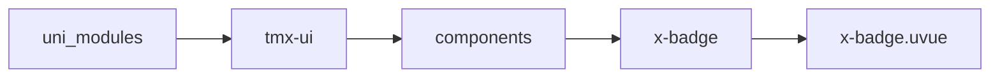
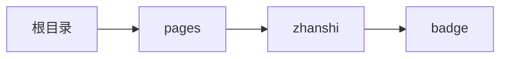

# 角标 xBadge
-------
<ViewMobile url="/pages/zhanshi/badge" />

## 介绍

角标

## 平台兼容

| Harmony | H5 | andriod | IOS | 小程序 | UTS | UNIAPP-X SDK | version |
| --- | --- | --- | --- | --- | --- | --- | --- |
| ☑ | ☑ | ☑️ | ☑️ | ☑️ | ☑️ | 4.76+ | 1.1.18 |


## 文件路径

``` ts

@/uni_modules/tmx-ui/components/x-badge/x-badge.uvue
```



## 使用

``` ts

<x-badge></x-badge>
```

## Props 属性

| 名称 | 说明 | 类型 | 默认值 |
| ------ | ---- | ---- | ---- |
| fontSize | `文字大小，可数字或者带单位`<br> | `string` | `"9"` |
| bgColor | `背景颜色，合法和颜色值及主题名称`<br> | `string` | `"error"` |
| fontColor | `文字颜色，合法和颜色值及主题名称`<br> | `string` | `"white"` |
| dot | `是否显示为点，优先级小于count,label`<br> | `boolean` | `true` |
| count | `是否显示为文本数字，优先级小于label`<br> | `number` | `0` |
| maxCount | `为数字时大于此值显示+号`<br> | `number` | `99` |
| label | `是否显示为文本，优先级最大`<br> | `string` | `""` |
| position | `位置`<br> | `positionType` | `"right"` |
| offset | `偏移`<br> | `Array` | `():number[] => [0, 0] as number[]` |


## Events 事件

| 名称 | 参数 | 说明 |
| ------ | ---- | ---- |


## Slots 插槽

| 名称 | 说明 | 数据 |
| ------ | ---- | ---- |
| default | `默认内容区域,你的正常内容放置在标签内` | - |


## Ref 方法

| 名称 | 参数 | 返回值 | 说明 |
| ------ | ---- | ---- | ---- |


## 示例文件路径

``` json

/pages/zhanshi/badge
```



## 示例源码

::: details uvue

<<< ../../../../pages/zhanshi/badge.uvue{vue}

:::

