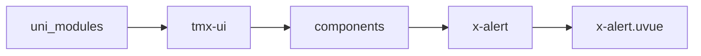
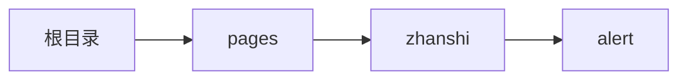

# 警告 xAlert
-------
<ViewMobile url="/pages/zhanshi/alert" />

## 介绍

样式丰富常用警告提醒

## 平台兼容

| Harmony | H5 | andriod | IOS | 小程序 | UTS | UNIAPP-X SDK | version |
| --- | --- | --- | --- | --- | --- | --- | --- |
| ☑ | ☑ | ☑️ | ☑️ | ☑️ | ☑️ | 4.76+ | 1.1.18 |


## 文件路径

``` ts

@/uni_modules/tmx-ui/components/x-alert/x-alert.uvue
```



## 使用

``` ts

<x-alert></x-alert>
```

## Props 属性

| 名称 | 说明 | 类型 | 默认值 |
| ------ | ---- | ---- | ---- |
| status | `类型`<br>`warn:警告`<br>`success:成功`<br>`error:错误`<br>`info:信息`<br>`primary:正常主题`<br> | `xAlertStatusType` | `"primary"` |
| icon | `警告图标,不填写取status默认图标`<br>`填写以填写为准`<br> | `string` | `""` |
| iconSize | `警告图标大小`<br> | `string` | `"20"` |
| closeIcon | `关闭图标`<br> | `string` | `"close-line"` |
| showClose | `显示还是隐藏关闭按钮`<br> | `boolean` | `true` |
| fontSize | `文字大小`<br> | `string` | `"15"` |
| color | `主题色，如果不填写以status为准`<br> | `string` | `""` |
| fontColor | `文字颜色，如果不填写以status为准`<br> | `string` | `""` |
| darkColor | `暗黑主题颜色，如果不填写自动计算`<br> | `string` | `""` |
| fontDarkColor | `暗黑文字颜色，如果不填写自动计算`<br> | `string` | `""` |
| skin | `它是建立在你没有提供color时才有效。`<br>`如果提供了color是以你color为背景最终色。`<br>`thin浅色模式，`<br>`normal标准背景色`<br> | `string` | `"thin"` |
| round | `圆角`<br>`数组数字时`<br>`[全部]`<br>`[顶左，顶右，底右，底左]`<br>`[顶左，底右]`<br>`[顶左，顶右，底右]`<br>`空数组时取全局值`<br> | `Array` | `():string[] => [] as string[]` |
| border | `边线`<br>`数组数字时`<br>`数组数字时`<br>`[全部]`<br>`[左，上，右，下]`<br>`[左右，上下]`<br>`[左，上，右]`<br>`空数组时取全局值`<br> | `Array` | `():string[] => [] as string[]` |
| borderColor | `边框颜色`<br>`格式同border边线。`<br>`空数组时取全局值`<br> | `Array` | `():string[] => [] as string[]` |
| darkBorderColor | `如果不填写，自动计算`<br> | `Array` | `():string[] => [] as string[]` |
| borderStyle | `边线类型，默认solid,可以为none`<br> | `string` | `'solid'` |
| margin | `间隙[x]全部,[x,x]左右，上下,[x,x,x]左上右,[x,x,x,x]左上右下`<br>`空数组时取全局值`<br> | `Array` | `():string[] => ['16', '0', '16', '16'] as string[]` |
| padding | `内间隙[x]全部,[x,x]左右，上下,[x,x,x]左上右,[x,x,x,x]左上右下`<br>`空数组时取全局值`<br> | `Array` | `():string[] => ['16', '12'] as string[]` |
| height | `自定义高度，可以是数字，单位或者百分比,auto`<br> | `string` | `"auto"` |
| width | `宽，单位合法即可数字，字符串带单位，百分比,auto`<br> | `string` | `"auto"` |


## Events 事件

| 名称 | 参数 | 说明 |
| ------ | ---- | ---- |
| close | `-` | 关闭时触发 |
| click | `-` | 组件被点击时触发 |


## Slots 插槽

| 名称 | 说明 | 数据 |
| ------ | ---- | ---- |
| left | `左边图标插槽` | - |
| default | `默认插槽内容` | - |


## Ref 方法

| 名称 | 参数 | 返回值 | 说明 |
| ------ | ---- | ---- | ---- |


## 示例文件路径

``` json

/pages/zhanshi/alert
```



## 示例源码

::: details uvue

<<< ../../../../pages/zhanshi/alert.uvue{vue}

:::

