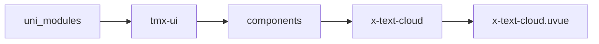
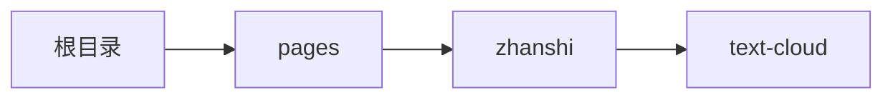

# 词云 TextCloud
-------
<ViewMobile url="/pages/zhanshi/text-cloud" />

## 介绍

词从中心向外椭圆螺旋紧凑排布，大小按权重自适应，不重叠。

## 平台兼容

| Harmony | H5 | andriod | IOS | 小程序 | UTS | UNIAPP-X SDK | version |
| --- | --- | --- | --- | --- | --- | --- | --- |
| ☑ | ☑ | ☑️ | ☑️ | ☑️ | ☑️ | 4.76+ | 1.1.18 |


## 文件路径

``` ts

@/uni_modules/tmx-ui/components/x-text-cloud/x-text-cloud.uvue
```



## 使用

``` ts

<x-text-cloud></x-text-cloud>
```

## Props 属性

| 名称 | 说明 | 类型 | 默认值 |
| ------ | ---- | ---- | ---- |
| width | ``<br> | `string` | `'100%'` |
| height | ``<br> | `string` | `'300rpx'` |
| backgroundColor | ``<br> | `string` | `'transparent'` |
| list | ``<br> | `Array` | `[] as TEXTCLOUD_ITEM_INFO[]` |
| color | ``<br> | `string` | `'primary'` |


## Events 事件

| 名称 | 参数 | 说明 |
| ------ | ---- | ---- |


## Slots 插槽

| 名称 | 说明 | 数据 |
| ------ | ---- | ---- |


## Ref 方法

| 名称 | 参数 | 返回值 | 说明 |
| ------ | ---- | ---- | ---- |


## 示例文件路径

``` json

/pages/zhanshi/text-cloud
```



## 示例源码

::: details uvue

<<< ../../../../pages/zhanshi/text-cloud.uvue{vue}

:::

