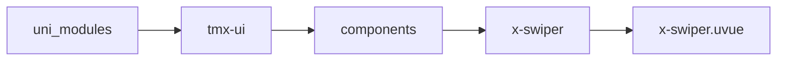
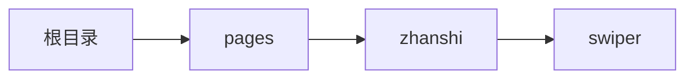

# 轮播 xSwiper
-------
<ViewMobile url="/pages/zhanshi/swiper" />

## 介绍

注意：本组件非官方的swiper轮播的封装，而是作者设计并开发的轮播，因此有些使用上的区别，请仔细看文档。
之所以要重新设计轮播，是为了后期的功能扩展。当前的一些功能已经比官方的还更好。
比如支持阻尼动效的设计，动效函数的设置。临界位置回弹的设置。指示点位置的偏移设置（这点非常有用，然官方不支持，而我的由于是自行开发的可以随意设置）
如果你有更多需求，你只需要阅读源码后自行扩展更多的功能。
内部只能放置子组件x-swiper-item

## 平台兼容

| Harmony | H5 | andriod | IOS | 小程序 | UTS | UNIAPP-X SDK | version |
| --- | --- | --- | --- | --- | --- | --- | --- |
| ☑ | ☑ | ☑️ | ☑️ | ☑️ | ☑️ | 4.76+ | 1.1.18 |


## 文件路径

``` ts

@/uni_modules/tmx-ui/components/x-swiper/x-swiper.uvue
```



## 使用

``` ts

<x-swiper></x-swiper>
```

## Props 属性

| 名称 | 说明 | 类型 | 默认值 |
| ------ | ---- | ---- | ---- |
| modelValue | `当前播放的索引值，可v-model动态更改。`<br> | `number` | `0` |
| width | `宽`<br> | `string` | `'auto'` |
| height | `高是必填，不可为auto。`<br> | `string` | `'150'` |
| threshold | `当滑动时小于此值，会回弹到原位。`<br> | `number` | `30` |
| damping | `拖动阻尼值，越小拖越费劲,1是不限制`<br> | `number` | `0.1` |
| animationDuration | `当打开或者松开时的动画时间`<br> | `number` | `350` |
| spaceOffset | `露边出来的距离，px单位`<br> | `number` | `0` |
| space | `露边出来的间隙，px单位`<br> | `number` | `0` |
| model | `模式：space/spaceIn/spaceOnly/card/空值`<br> | `string` | `''` |
| animationFun | `缓动动画函数`<br> | `string` | `'cubic-bezier(0, 0.55, 0.45, 1)'` |
| duration | `轮播时的间隔`<br> | `number` | `5000` |
| vertical | `是否竖向`<br> | `boolean` | `false` |
| round | `圆角`<br> | `string` | `'10'` |
| dotColor | `指示点的颜色`<br> | `string` | `'rgba(255,255,255,0.5)'` |
| dotActiveColor | `指示点的激活色`<br> | `string` | `'rgba(255,255,255,1)'` |
| dotOffset | `指示点距离边界的位置`<br> | `string` | `'15'` |
| dotSize | `指示点大小`<br> | `string` | `'6'` |
| showDot | `是否显示指示`<br> | `boolean` | `true` |
| autoPlay | `是否开启自动播放`<br> | `boolean` | `true` |
| loop | `是否循环`<br> | `boolean` | `true` |
| showLastView | `是否显示最后视图`<br> | `boolean` | `false` |
| showScalAni | `是否开启缩放动画`<br> | `boolean` | `false` |


## Events 事件

| 名称 | 参数 | 说明 |
| ------ | ---- | ---- |
| change | `index: number` | 切换变化时触发 |
| click | `index: number` | 组件被点击时触发。 |
| dragLastEnd | `-` | 当用户拖拉时，拖到最右侧最后一个后，还继续拉，拉不动时触发 |
| update:modelValue | `-` | - |


## Slots 插槽

| 名称 | 说明 | 数据 |
| ------ | ---- | ---- |
| default | `插槽内只允许放其子节点x-swiper-item` | - |
| lastView | `-` | - |
| dotV | `竖向指示插槽,可完全自定义指示样式` | current: number<br>current: number<br>len: number<br>len: number<br> |
| dot | `横向指示插槽,可完全自定义指示样式` | current: number<br>current: number<br>len: number<br>len: number<br> |


## Ref 方法

| 名称 | 参数 | 返回值 | 说明 |
| ------ | ---- | ---- | ---- |
| pushAdd | - | `-` | - |
| delItem | - | `-` | - |
| mStart | - | `-` | - |
| mMove | - | `-` | - |
| mEnd | - | `-` | - |
| swiperClick | - | `-` | - |
| mmStart | - | `-` | - |
| mmMove | - | `-` | - |
| mmEnd | - | `-` | - |
| parentId | - | `-` | - |


## 示例文件路径

``` json

/pages/zhanshi/swiper
```



## 示例源码

::: details uvue

<<< ../../../../pages/zhanshi/swiper.uvue{vue}

:::

