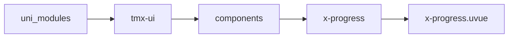
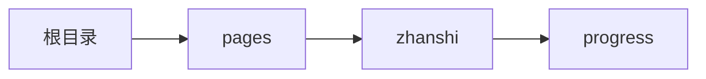

# 进度条 xProgress
-------
<ViewMobile url="/pages/zhanshi/progress" />

## 介绍

使用，允许设置min,max值，如果你的双向绑定的vale值超过min,max的合法值，将会被转换为正确值。

## 平台兼容

| Harmony | H5 | andriod | IOS | 小程序 | UTS | UNIAPP-X SDK | version |
| --- | --- | --- | --- | --- | --- | --- | --- |
| ☑ | ☑ | ☑️ | ☑️ | ☑️ | ☑️ | 4.76+ | 1.1.18 |


## 文件路径

``` ts

@/uni_modules/tmx-ui/components/x-progress/x-progress.uvue
```



## 使用

``` ts

<x-progress></x-progress>
```

## Props 属性

| 名称 | 说明 | 类型 | 默认值 |
| ------ | ---- | ---- | ---- |
| min | `最小值`<br> | `number` | `0` |
| max | `最大值`<br> | `number` | `100` |
| modelValue | `当前的值`<br>`等同v-model=""`<br> | `number` | `0` |
| color | `进度条激活时的颜色`<br>`为空时，取全局配置的值`<br> | `string` | `""` |
| bgColor | `背景颜色`<br> | `string` | `"info"` |
| darkBgColor | `暗黑背景颜色，如果不设置取inputDarkColor`<br> | `string` | `""` |
| showLabel | `是否显示进度条上的label文本`<br> | `boolean` | `false` |
| labelColor | `文本颜色`<br> | `string` | `"white"` |
| labelFontSize | `文本文字大小`<br> | `string` | `"10"` |
| size | `进度条的大小`<br> | `string` | `"4"` |
| round | `圆角。`<br>`为空值时，取全局的统一值`<br> | `string` | `""` |
| duration | `动画持续的时间`<br> | `number` | `350` |
| linearColor | `渐变背景，使用使用正经的background-image请查阅官方文档,例：'linear-gradient(to bottom,red,green)'`<br>`注意不要动态在渐变和color间切换原生不支持这样操作，会渲染异常的。`<br> | `string` | `''` |


## Events 事件

| 名称 | 参数 | 说明 |
| ------ | ---- | ---- |
| update:modelValue | `-` | - |


## Slots 插槽

| 名称 | 说明 | 数据 |
| ------ | ---- | ---- |
| default | `默认标签文本插槽，需要设置:showLabel="true"` | value: number<br>value: number<br>percentage: number<br>percentage: number<br> |
| right | `右插槽` | value: number<br>value: number<br>percentage: number<br>percentage: number<br> |


## Ref 方法

| 名称 | 参数 | 返回值 | 说明 |
| ------ | ---- | ---- | ---- |


## 示例文件路径

``` json

/pages/zhanshi/progress
```



## 示例源码

::: details uvue

<<< ../../../../pages/zhanshi/progress.uvue{vue}

:::

