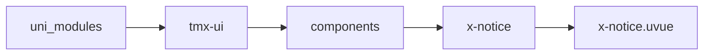
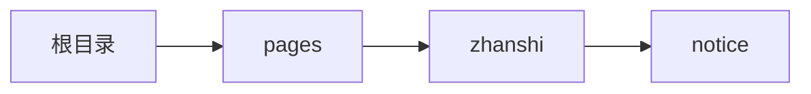

# 通知栏 xNotice
-------
<ViewMobile url="/pages/zhanshi/notice" />

## 介绍

速度可控，样式比较方便的调整。如果想要竖向的，请使用官方的轮播实现。

## 平台兼容

| Harmony | H5 | andriod | IOS | 小程序 | UTS | UNIAPP-X SDK | version |
| --- | --- | --- | --- | --- | --- | --- | --- |
| ☑ | ☑ | ☑️ | ☑️ | ☑️ | ☑️ | 4.76+ | 1.1.18 |


## 文件路径

``` ts

@/uni_modules/tmx-ui/components/x-notice/x-notice.uvue
```



## 使用

``` ts

<x-notice></x-notice>
```

## Props 属性

| 名称 | 说明 | 类型 | 默认值 |
| ------ | ---- | ---- | ---- |
| speed | `速率`<br> | `number` | `50` |
| color | `背景色`<br> | `string` | `"#ebf4ff"` |
| darkColor | `暗黑时的背景色，如果不填写，取color暗黑浅背景。`<br> | `string` | `""` |
| fontColor | `文字和图标色`<br> | `string` | `"primary"` |
| fontSize | `文字大小和图标大小`<br> | `string` | `"14"` |
| icon | `图标，如果为空将不显示 。`<br> | `string` | `"megaphone-line"` |
| iconColor | `不填写的话取fontColor`<br> | `string` | `""` |
| iconSize | `不填写的话取fontSize`<br> | `string` | `""` |
| label | `通知文本。`<br> | `Array` | `():string[] =>[] as string[]` |


## Events 事件

| 名称 | 参数 | 说明 |
| ------ | ---- | ---- |
| click | `index: number` | 项目被点击 |


## Slots 插槽

| 名称 | 说明 | 数据 |
| ------ | ---- | ---- |


## Ref 方法

| 名称 | 参数 | 返回值 | 说明 |
| ------ | ---- | ---- | ---- |


## 示例文件路径

``` json

/pages/zhanshi/notice
```



## 示例源码

::: details uvue

<<< ../../../../pages/zhanshi/notice.uvue{vue}

:::

