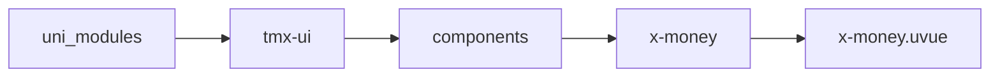
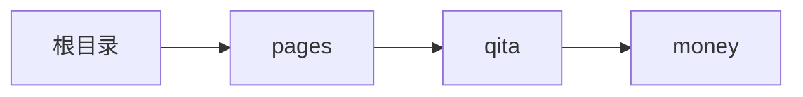

# 金额栅格 xMoney
-------
<ViewMobile url="/pages/qita/money" />

## 介绍

对金额进行栅格化

## 平台兼容

| Harmony | H5 | andriod | IOS | 小程序 | UTS | UNIAPP-X SDK | version |
| --- | --- | --- | --- | --- | --- | --- | --- |
| ☑ | ☑ | ☑️ | ☑️ | ☑️ | ☑️ | 4.76+ | 1.1.18 |


## 文件路径

``` ts

@/uni_modules/tmx-ui/components/x-money/x-money.uvue
```



## 使用

``` ts

<x-money></x-money>
```

## Props 属性

| 名称 | 说明 | 类型 | 默认值 |
| ------ | ---- | ---- | ---- |
| digit | `小数点后几位`<br> | `number` | `2` |
| thousand | `开启千分位`<br> | `boolean` | `false` |
| thousandUnit | `千分位的分隔符`<br> | `string` | `","` |
| thousandLen | `千分位的长度，`<br>`默认是3位一位，如果为4就是万分位依此类推`<br> | `number` | `3` |
| symbolText | `货币符号`<br> | `string` | `'￥'` |
| symbolPosition | `货币符号位置`<br>`left:左侧`<br>`right:右侧`<br> | `string` | `'left'` |
| color | `文字颜色`<br> | `string` | `'primary'` |
| darkColor | `暗黑时的文字颜色`<br> | `string` | `''` |
| fontSize | `文字大小`<br> | `string` | `'16'` |
| preFontSize | `货币符号及小数字号大小`<br> | `string` | `'16'` |
| showCn | `是否显示中文金额`<br> | `boolean` | `false` |


## Events 事件

| 名称 | 参数 | 说明 |
| ------ | ---- | ---- |


## Slots 插槽

| 名称 | 说明 | 数据 |
| ------ | ---- | ---- |
| default | `默认插槽` | inter: string<br>inter: string<br>inter: string<br>inter: string<br>digit: string<br>digit: string<br>digit: string<br>digit: string<br>cn: string<br>cn: string<br>cn: string<br>cn: string<br>lineHeight: string<br>lineHeight: string<br>lineHeight: string<br>lineHeight: string<br> |


## Ref 方法

| 名称 | 参数 | 返回值 | 说明 |
| ------ | ---- | ---- | ---- |


## 示例文件路径

``` json

/pages/qita/money
```



## 示例源码

::: details uvue

<<< ../../../../pages/qita/money.uvue{vue}

:::

