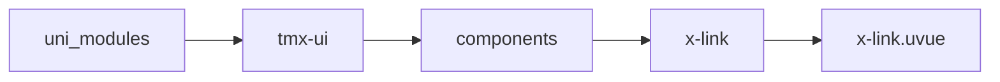
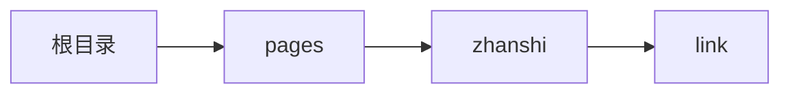

# 链接 xLink
-------
<ViewMobile url="/pages/zhanshi/link" />

## 介绍

链接可以打开指定的页面,也可以打开外链(打开外链依赖于x-openweb插件,加密用户请联系发你源码自行源码编译)
微信小程序无法打开外链,微信小程序正式版本pc版本可以打开外链,真机手机仅可打开应用内页面.

## 平台兼容

| Harmony | H5 | andriod | IOS | 小程序 | UTS | UNIAPP-X SDK | version |
| --- | --- | --- | --- | --- | --- | --- | --- |
| ☑ | ☑ | ☑️ | ☑️ | ☑️ | ☑️ | 4.76+ | 1.1.18 |


## 文件路径

``` ts

@/uni_modules/tmx-ui/components/x-link/x-link.uvue
```



## 使用

``` ts

<x-link></x-link>
```

## Props 属性

| 名称 | 说明 | 类型 | 默认值 |
| ------ | ---- | ---- | ---- |
| href | `需要打开的链接,可以是页面地址也可以是网页链接地址.`<br> | `string` | `""` |
| color | `空值时取全局主题`<br> | `string` | `""` |
| fontSize | `字号,rpx,px,单位均可`<br> | `string` | `"15"` |
| line | `是否需要下划线`<br> | `boolean` | `false` |
| openType | `打开方式,如果是网页链接将启动新的窗口打开.`<br> | `NAVIGATE_TYPE` | `"navigate"` |
| prefix | `前缀图标名称`<br> | `string` | `"links-line"` |
| suffix | `后缀图标名称`<br> | `string` | `""` |
| _style | ``<br> | `string` | `""` |


## Events 事件

| 名称 | 参数 | 说明 |
| ------ | ---- | ---- |
| click | `-` | 点击事件 |


## Slots 插槽

| 名称 | 说明 | 数据 |
| ------ | ---- | ---- |
| default | `默认插槽，仅可放置文本` | - |


## Ref 方法

| 名称 | 参数 | 返回值 | 说明 |
| ------ | ---- | ---- | ---- |


## 示例文件路径

``` json

/pages/zhanshi/link
```



## 示例源码

::: details uvue

<<< ../../../../pages/zhanshi/link.uvue{vue}

:::

