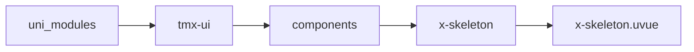
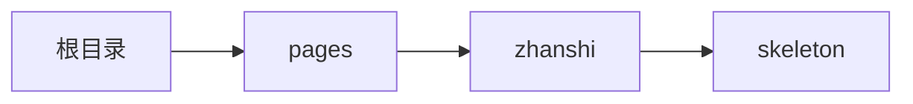

# 骨架屏 xSkeleton
-------
<ViewMobile url="/pages/zhanshi/skeleton" />

## 介绍

样式灵活多变。

## 平台兼容

| Harmony | H5 | andriod | IOS | 小程序 | UTS | UNIAPP-X SDK | version |
| --- | --- | --- | --- | --- | --- | --- | --- |
| ☑ | ☑ | ☑️ | ☑️ | ☑️ | ☑️ | 4.76+ | 1.1.18 |


## 文件路径

``` ts

@/uni_modules/tmx-ui/components/x-skeleton/x-skeleton.uvue
```



## 使用

``` ts

<x-skeleton></x-skeleton>
```

## Props 属性

| 名称 | 说明 | 类型 | 默认值 |
| ------ | ---- | ---- | ---- |
| height | `高，单位允许%，auto,'数字',rpx,px`<br> | `string` | `'12'` |
| width | `宽，单位允许%，auto,'数字',rpx,px`<br> | `string` | `'auto'` |
| color | `背景颜色`<br> | `string` | `'#e4e4e4'` |
| darkColor | `暗黑背景颜色`<br> | `string` | `'#323232'` |
| round | `圆角`<br> | `string` | `'3'` |
| duration | `动画间隔`<br> | `string` | `'900ms'` |


## Events 事件

| 名称 | 参数 | 说明 |
| ------ | ---- | ---- |


## Slots 插槽

| 名称 | 说明 | 数据 |
| ------ | ---- | ---- |


## Ref 方法

| 名称 | 参数 | 返回值 | 说明 |
| ------ | ---- | ---- | ---- |


## 示例文件路径

``` json

/pages/zhanshi/skeleton
```



## 示例源码

::: details uvue

<<< ../../../../pages/zhanshi/skeleton.uvue{vue}

:::

