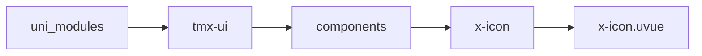
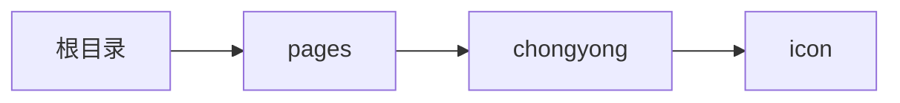

# 图标 xIcon
-------
<ViewMobile url="/pages/chongyong/icon" />

## 介绍

图标使用的是开源图标:[https://remixicon.com/](https://remixicon.com/)，版本是：4.5.0 ，使用时，不用带ri-前缀。

## 平台兼容

| Harmony | H5 | andriod | IOS | 小程序 | UTS | UNIAPP-X SDK | version |
| --- | --- | --- | --- | --- | --- | --- | --- |
| ☑ | ☑ | ☑️ | ☑️ | ☑️ | ☑️ | 4.76+ | 1.1.18 |


## 文件路径

``` ts

@/uni_modules/tmx-ui/components/x-icon/x-icon.uvue
```



## 使用

``` ts

<x-icon></x-icon>
```

## Props 属性

| 名称 | 说明 | 类型 | 默认值 |
| ------ | ---- | ---- | ---- |
| name | `图标名称，不带ri-前缀（不推荐在app上使用这个属性,建议使用code显示,性能明显更快）`<br>`也可以是本地或者远程图片`<br> | `string` | `"home-3-fill"` |
| fontSize | `图标大小,单位任意,比如"12",12px,12rpx`<br> | `union` | `"16"` |
| fontFamily | `自定义图标字体，前提是`<br>`你要在appuvue中已经安装好字体文件，`<br>`否则无法使用。`<br>`要让自定图标生效你需要配合code属性一起使用`<br> | `string` | `"remixicon"` |
| code | `图标的16进制字符串，注意不含u`<br>`比如：ea0c，ea14这种，`<br>`如果你提供了code优化解析这，那么name将失效，如果你是纯字体图标使用`<br>`你可以使用这个属性，可以提供性能和自己定义的图标会比较方便。`<br> | `string` | `""` |
| color | `图标颜色`<br> | `string` | `"black"` |
| darkColor | `暗黑时的文本颜色，如果你不提供，将自动反转。`<br>`自动反转是根据亮度反转，色相不变。`<br> | `string` | `""` |
| spin | `是否旋转动画`<br> | `boolean` | `false` |
| rotation | `旋转角度`<br> | `number` | `0` |
| duration | `动画时间`<br> | `number` | `1500` |


## Events 事件

| 名称 | 参数 | 说明 |
| ------ | ---- | ---- |
| click | `-` | - |


## Slots 插槽

| 名称 | 说明 | 数据 |
| ------ | ---- | ---- |


## Ref 方法

| 名称 | 参数 | 返回值 | 说明 |
| ------ | ---- | ---- | ---- |


## 示例文件路径

``` json

/pages/chongyong/icon
```



## 示例源码

::: details uvue

<<< ../../../../pages/chongyong/icon.uvue{vue}

:::

