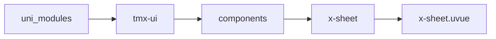
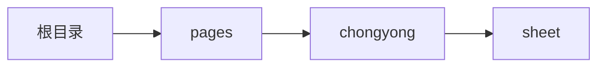

# 容器 xSheet
-------
<ViewMobile url="/pages/chongyong/sheet" />

## 介绍

可方便快速的更改属性以塑造符合你的设计风格。背景，圆角，间隙等统一风格可全局配置。
主要是用来统一页面风格，间距等可统一设置，提高设计的一致性。

## 平台兼容

| Harmony | H5 | andriod | IOS | 小程序 | UTS | UNIAPP-X SDK | version |
| --- | --- | --- | --- | --- | --- | --- | --- |
| ☑ | ☑ | ☑️ | ☑️ | ☑️ | ☑️ | 4.76+ | 1.1.18 |


## 文件路径

``` ts

@/uni_modules/tmx-ui/components/x-sheet/x-sheet.uvue
```



## 使用

``` ts

<x-sheet></x-sheet>
```

## Props 属性

| 名称 | 说明 | 类型 | 默认值 |
| ------ | ---- | ---- | ---- |
| color | `主题背景`<br> | `string` | `'white'` |
| darkColor | `暗黑时的主题背景，空值取全局`<br> | `string` | `''` |
| followTheme | `是否让背景色跟随主题，默认是白色，不跟随。`<br> | `boolean` | `false` |
| hoverColor | `按下时的焦点色`<br> | `string` | `''` |
| url | `页面地址，提供时，点击可导航到该页面`<br> | `string` | `''` |
| linearGradient | `渐变背景，提供时前面的color,dakColor将失效，格式为数组3长度[方向，颜色1，颜色2]`<br> | `Array` | `[] as string[]` |
| round | `圆角空值取全局[全部]，[左，右],[左，上，右],[左，上，右，下]`<br> | `any` | `''` |
| border | `边大小[全部]，[左，右],[左，上，右],[左，上，右，下]`<br> | `any` | `''` |
| shadow | `投影：[y轴值，模糊值，颜色]`<br> | `Array` | `():string[] => ([] as string[])` |
| borderColor | `边颜色[全部]，[左，右],[左，上，右],[左，上，右，下]`<br> | `Array` | `():string[] => ([] as string[])` |
| darkBorderColor | `暗黑时边颜色[全部]，[左，右],[左，上，右],[左，上，右，下]`<br> | `Array` | `():string[] => ([] as string[])` |
| borderStyle | `边类型[全部]，[左，右],[左，上，右],[左，上，右，下]`<br> | `string` | `'solid'` |
| margin | `外边距[全部]，[左，右],[左，上，右],[左，上，右，下]`<br> | `any` | `''` |
| padding | `内边距[全部]，[左，右],[左，上，右],[左，上，右，下]`<br> | `any` | `''` |
| isLink | `是否为链接类型，是的话有点按效果`<br> | `boolean` | `false` |
| loading | `是否让内容处于加载状态`<br> | `boolean` | `false` |
| height | `高：rpx,px,%，数字等都行`<br> | `union` | `'auto'` |
| width | `宽：rpx,px,%，数字等都行`<br> | `union` | `'auto'` |


## Events 事件

| 名称 | 参数 | 说明 |
| ------ | ---- | ---- |
| click | `-` | - |


## Slots 插槽

| 名称 | 说明 | 数据 |
| ------ | ---- | ---- |
| default | `默认插槽` | - |


## Ref 方法

| 名称 | 参数 | 返回值 | 说明 |
| ------ | ---- | ---- | ---- |


## 示例文件路径

``` json

/pages/chongyong/sheet
```



## 示例源码

::: details uvue

<<< ../../../../pages/chongyong/sheet.uvue{vue}

:::

