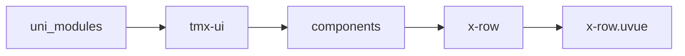
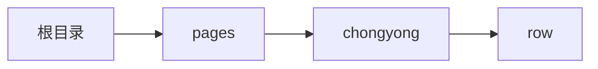

# 布局 xRow
-------
<ViewMobile url="/pages/chongyong/row" />

## 介绍

内部标签只可旋转x-col子组件。

## 平台兼容

| Harmony | H5 | andriod | IOS | 小程序 | UTS | UNIAPP-X SDK | version |
| --- | --- | --- | --- | --- | --- | --- | --- |
| ☑ | ☑ | ☑️ | ☑️ | ☑️ | ☑️ | 4.76+ | 1.1.18 |


## 文件路径

``` ts

@/uni_modules/tmx-ui/components/x-row/x-row.uvue
```



## 使用

``` ts

<x-row></x-row>
```

## Props 属性

| 名称 | 说明 | 类型 | 默认值 |
| ------ | ---- | ---- | ---- |
| col | `默认12列数`<br> | `number` | `12` |
| justify | `默认start，子元素左右对齐排列`<br> | `union` | `"start"` |
| align | `默认flex-start，子元素上下对齐排列`<br> | `union` | `"flex-start"` |
| wrap | `是否自动断行`<br> | `boolean` | `true` |


## Events 事件

| 名称 | 参数 | 说明 |
| ------ | ---- | ---- |


## Slots 插槽

| 名称 | 说明 | 数据 |
| ------ | ---- | ---- |
| default | `只可放置x-col子组件。` | - |


## Ref 方法

| 名称 | 参数 | 返回值 | 说明 |
| ------ | ---- | ---- | ---- |


## 示例文件路径

``` json

/pages/chongyong/row
```



## 示例源码

::: details uvue

<<< ../../../../pages/chongyong/row.uvue{vue}

:::

