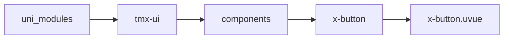
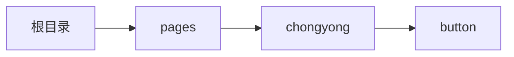

# 按钮 xButton
-------
<ViewMobile url="/pages/chongyong/button" />

## 介绍

圆角，主题可通过配置统一设置或者动态全局设置，使设计风格统一并保持一致性。让你的风格独一无二。

## 平台兼容

| Harmony | H5 | andriod | IOS | 小程序 | UTS | UNIAPP-X SDK | version |
| --- | --- | --- | --- | --- | --- | --- | --- |
| ☑ | ☑ | ☑️ | ☑️ | ☑️ | ☑️ | 4.76+ | 1.1.18 |


## 文件路径

``` ts

@/uni_modules/tmx-ui/components/x-button/x-button.uvue
```



## 使用

``` ts

<x-button></x-button>
```

## Props 属性

| 名称 | 说明 | 类型 | 默认值 |
| ------ | ---- | ---- | ---- |
| color | `主题颜色，空取全局`<br> | `string` | `''` |
| darkColor | `暗黑主题颜色，空取全局`<br> | `string` | `''` |
| bgColor | `自定背景色`<br> | `string` | `''` |
| linearGradient | `渐变[方向，颜色1，颜色2]`<br> | `Array` | `():string[] => [] as string[]` |
| fontColor | `字号颜色`<br> | `string` | `''` |
| fontDarkColor | `暗黑字号颜色`<br> | `string` | `''` |
| fontSize | `字号大小`<br> | `union` | `''` |
| round | `圆角，空取全局`<br> | `union` | `''` |
| border | `边线大小`<br> | `union` | `0.5` |
| shadow | `投影[x,y,大小]`<br> | `Array` | `():number[] => [] as number[]` |
| borderColor | `边线颜色`<br> | `string` | `''` |
| skin | `样式主题"default" \`<br>` "secondary" \`<br>` "text" \`<br>` "outline" \`<br>` "dashed" \`<br>` "thin"`<br> | `SkinType` | `'default' as SkinType` |
| icon | `按钮图标`<br> | `string` | `''` |
| iconBtn | `是否是纯按钮图标`<br> | `boolean` | `false` |
| iconSize | `图标大小`<br> | `union` | `''` |
| size | `按钮大小"mini" \`<br>` "large" \`<br>` "normal" \`<br>` "small"`<br> | `SizeType` | `'normal' as SizeType` |
| url | `跳转链接`<br> | `string` | `''` |
| navigateMode | `跳转方式，同官方`<br> | `string` | `'navigateTo'` |
| disabled | `是否禁用`<br> | `boolean` | `false` |
| loading | `加载状态`<br> | `boolean` | `false` |
| height | `高`<br> | `union` | `''` |
| width | `宽`<br> | `union` | `''` |
| block | `是否占据整行`<br> | `union` | `false` |
| formType | `是否作为x-form提交表单用于触发提交表单`<br> | `union` | `'' as 'form'   ''` |
| lineHeight | `行高`<br> | `union` | `'1.4'` |
| fontWeight | `加粗`<br> | `string` | `'normal'` |
| openType | `开放类型，同官方`<br> | `string` | `''` |
| lang | ``<br> | `string` | `'en'` |
| sessionFrom | ``<br> | `string` | `''` |
| sendMessageTitle | ``<br> | `string` | `''` |
| sendMessagePath | ``<br> | `string` | `''` |
| sendMessageImg | ``<br> | `string` | `''` |
| appParameter | ``<br> | `string` | `''` |
| showMessageCard | ``<br> | `boolean` | `false` |
| phoneNumberNoQuotaToast | ``<br> | `boolean` | `true` |


## Events 事件

| 名称 | 参数 | 说明 |
| ------ | ---- | ---- |
| click | `-` | - |
| getuserinfo | `-` | - |
| contact | `-` | - |
| getphonenumber | `-` | - |
| getrealtimephonenumber | `-` | - |
| error | `-` | - |
| opensetting | `-` | - |
| launchapp | `-` | - |
| chooseavatar | `-` | - |
| chooseaddress | `-` | - |
| chooseinvoicetitle | `-` | - |
| addgroupapp | `-` | - |
| subscribe | `-` | - |
| login | `-` | - |
| agreeprivacyauthorization | `-` | - |


## Slots 插槽

| 名称 | 说明 | 数据 |
| ------ | ---- | ---- |
| default | `默认插槽` | - |


## Ref 方法

| 名称 | 参数 | 返回值 | 说明 |
| ------ | ---- | ---- | ---- |


## 示例文件路径

``` json

/pages/chongyong/button
```



## 示例源码

::: details uvue

<<< ../../../../pages/chongyong/button.uvue{vue}

:::

