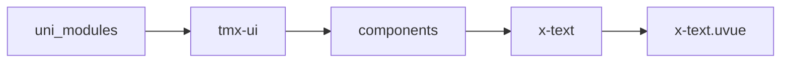
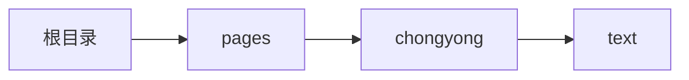

# 文本 xText
-------
<ViewMobile url="/pages/chongyong/text" />

## 介绍

支持多文本高亮显示，目前uniapp x 4.0.1+正则。
可允许拓展：比如根据正则高亮电话号码，邮箱等，点击后打电话，发邮件。使用时一定要注意:尽量标签内容写文本,不要用label属性,label属性是用来高亮和正则的

## 平台兼容

| Harmony | H5 | andriod | IOS | 小程序 | UTS | UNIAPP-X SDK | version |
| --- | --- | --- | --- | --- | --- | --- | --- |
| ☑ | ☑ | ☑️ | ☑️ | ☑️ | ☑️ | 4.76+ | 1.1.18 |


## 文件路径

``` ts

@/uni_modules/tmx-ui/components/x-text/x-text.uvue
```



## 使用

``` ts

<x-text></x-text>
```

## Props 属性

| 名称 | 说明 | 类型 | 默认值 |
| ------ | ---- | ---- | ---- |
| _style | `自定文件标签的样式`<br> | `string` | `""` |
| _class | `自定文件标签的类,仅对标签插槽内的有效,如果使用label属性会变成richtext渲染,因为类将失效.`<br> | `string` | `""` |
| label | `源文本，显示 的文本。`<br> | `string` | `""` |
| highlight | `需要特别高亮的词`<br> | `Array` | `() : string[] => [] as string[]` |
| highlightReg | `高亮的正则,`<br>`请尽量不要和highlight字段结果集重叠,`<br>`也不要提供的正则数组出现重叠混乱。`<br>`默认是正则电话，邮箱`<br> | `Array` | `() : string[] => [] as string[]` |
| highlightStyle | `高亮文本的自定义样式`<br> | `string` | `""` |
| lines | `最多显示几行，默认0不限制。`<br>`超过了此行会出现省略号。`<br> | `number` | `0` |
| selectable | `是否允许复制。`<br> | `boolean` | `false` |
| color | `文本颜色`<br> | `string` | `""` |
| darkColor | `暗黑时的文本颜色，如果你不提供，将自动反转。`<br>`自动反转是根据亮度反转，色相不变。`<br> | `string` | `""` |
| highlightColor | `高亮颜色`<br> | `string` | `"primary"` |
| lineHeight | `行高`<br> | `union` | `"1.7"` |
| fontSize | `文字大小。`<br> | `union` | `""` |


## Events 事件

| 名称 | 参数 | 说明 |
| ------ | ---- | ---- |
| click | `-` | 点击时触发 |
| item-click | `undefinedstr: string` | 正则的项目被点击 |


## Slots 插槽

| 名称 | 说明 | 数据 |
| ------ | ---- | ---- |
| default | `默认文本插槽，如果使用插槽，那么相关特性功能将会失效。` | - |


## Ref 方法

| 名称 | 参数 | 返回值 | 说明 |
| ------ | ---- | ---- | ---- |


## 示例文件路径

``` json

/pages/chongyong/text
```



## 示例源码

::: details uvue

<<< ../../../../pages/chongyong/text.uvue{vue}

:::

