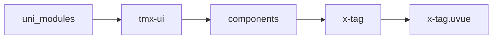
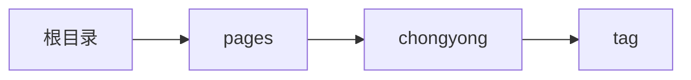

# 标签 xTag
-------
<ViewMobile url="/pages/chongyong/tag" />

## 介绍

标签组件，可用于属性的提醒，显示，强调用。

## 平台兼容

| Harmony | H5 | andriod | IOS | 小程序 | UTS | UNIAPP-X SDK | version |
| --- | --- | --- | --- | --- | --- | --- | --- |
| ☑ | ☑ | ☑️ | ☑️ | ☑️ | ☑️ | 4.76+ | 1.1.18 |


## 文件路径

``` ts

@/uni_modules/tmx-ui/components/x-tag/x-tag.uvue
```



## 使用

``` ts

<x-tag></x-tag>
```

## Props 属性

| 名称 | 说明 | 类型 | 默认值 |
| ------ | ---- | ---- | ---- |
| _class | `额外的 class 名（会追加到组件根节点）`<br> | `string` | `''` |
| _style | `额外的内联样式字符串`<br> | `string` | `''` |
| color | `标签主色`<br> | `string` | `''` |
| bgColor | `背景色（浅色模式）`<br> | `string` | `''` |
| darkBgColor | `背景色（深色模式）`<br> | `string` | `''` |
| linearGradient | `线性渐变颜色数组（如 ['to bottom','#00f', '#0ff']）`<br> | `Array` | `():string[] => [] as string[]` |
| fontColor | `文本颜色`<br> | `string` | `''` |
| fontSize | `文本字号，例如 '24rpx','24px','24'`<br> | `string` | `''` |
| round | `圆角半径，默认单位 px`<br> | `number` | `-1` |
| border | `边框宽度，默认单位 px`<br> | `number` | `1` |
| borderColor | `边框颜色（浅色模式）`<br> | `string` | `''` |
| darkBorderColor | `边框颜色（深色模式）`<br> | `string` | `''` |
| skin | `预设皮肤/风格类型`<br> | `SkinType` | `'default' as SkinType` |
| icon | `左侧图标名称或资源`<br> | `string` | `''` |
| size | `组件尺寸（预设枚举）`<br> | `SizeType` | `'normal' as SizeType` |
| url | `点击后跳转的链接地址`<br> | `string` | `''` |
| disabled | `是否禁用`<br> | `boolean` | `false` |
| loading | `是否显示加载状态`<br> | `boolean` | `false` |
| height | `组件高度，例如 '48rpx','48','48px'`<br> | `string` | `''` |


## Events 事件

| 名称 | 参数 | 说明 |
| ------ | ---- | ---- |
| click | `-` | - |


## Slots 插槽

| 名称 | 说明 | 数据 |
| ------ | ---- | ---- |
| default | `默认插槽` | - |


## Ref 方法

| 名称 | 参数 | 返回值 | 说明 |
| ------ | ---- | ---- | ---- |


## 示例文件路径

``` json

/pages/chongyong/tag
```



## 示例源码

::: details uvue

<<< ../../../../pages/chongyong/tag.uvue{vue}

:::

