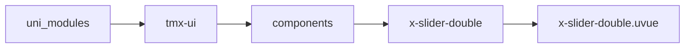
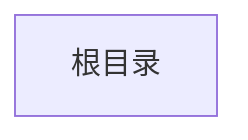

# 双向滑块 xSliderDouble
-------
<ViewMobile url="" />

## 介绍

此为双向滑块,单向滑块见:x-slider

## 平台兼容

| Harmony | H5 | andriod | IOS | 小程序 | UTS | UNIAPP-X SDK | version |
| --- | --- | --- | --- | --- | --- | --- | --- |
| ☑ | ☑ | ☑️ | ☑️ | ☑️ | ☑️ | 4.76+ | 1.1.18 |


## 文件路径

``` ts

@/uni_modules/tmx-ui/components/x-slider-double/x-slider-double.uvue
```



## 使用

``` ts

<x-slider-double></x-slider-double>
```

## Props 属性

| 名称 | 说明 | 类型 | 默认值 |
| ------ | ---- | ---- | ---- |
| modelValue | `等同v-model当前值`<br> | `Array` | `() : number[] => [0, 0] as number[]` |
| max | `最大值`<br> | `number` | `100` |
| min | `最小值`<br> | `number` | `0` |
| disabled | `是否禁用`<br> | `boolean` | `false` |
| step | `步进值`<br> | `number` | `1` |
| stepCount | `步进刻度数量`<br> | `number` | `0` |
| color | `激活时的颜色，空值取全局值`<br> | `string` | `""` |
| bgColor | `默认的背景色`<br> | `string` | `"info"` |
| size | `滑条的大小`<br> | `string` | `"3"` |
| btnSize | `滑块的尺寸`<br> | `string` | `"24"` |
| round | `滑条的圆角，空值取全局进度条值`<br> | `string` | `""` |
| showLabel | `是否显示进度条上的label文本`<br> | `boolean` | `false` |
| labelColor | `文本颜色`<br> | `string` | `"black"` |
| labelFontSize | `文本文字大小`<br> | `string` | `"12"` |


## Events 事件

| 名称 | 参数 | 说明 |
| ------ | ---- | ---- |
| change | `-` | 拖动变换时触发 |
| update:modelValue | `-` | - |


## Slots 插槽

| 名称 | 说明 | 数据 |
| ------ | ---- | ---- |
| right | `右插槽` | value: number[]<br>value: number[]<br>percentage: number[]<br>percentage: number[]<br> |


## Ref 方法

| 名称 | 参数 | 返回值 | 说明 |
| ------ | ---- | ---- | ---- |


## 示例文件路径

``` json


```



## 示例源码

::: details uvue


:::

