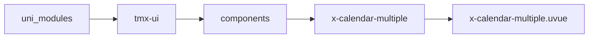
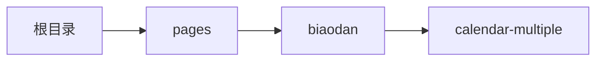

# 多选日历 xCalendarMultiple
-------
<ViewMobile url="/pages/biaodan/calendar-multiple" />

## 介绍

可以单选和多选，无限循环滚动，目前4.67dev以下版本使用可能会有性能风险，请关注后续官方针对性的优化。

## 平台兼容

| Harmony | H5 | andriod | IOS | 小程序 | UTS | UNIAPP-X SDK | version |
| --- | --- | --- | --- | --- | --- | --- | --- |
| - | ☑ | ☑️ | ☑️ | ☑️ | ☑️ | 4.76+ | 1.1.18 |


## 文件路径

``` ts

@/uni_modules/tmx-ui/components/x-calendar-multiple/x-calendar-multiple.uvue
```



## 使用

``` ts

<x-calendar-multiple></x-calendar-multiple>
```

## Props 属性

| 名称 | 说明 | 类型 | 默认值 |
| ------ | ---- | ---- | ---- |
| modelValue | `同步当前时间v-model`<br>`不想受控:model-value`<br> | `Array` | `() : string[] => [] as string[]` |
| model | `范围选择模式`<br>`day:天数多选，通过multipleMax可以设置允许选择的天数`<br>`range:天数的范围选择，起始和终止`<br>`week:按周次选择范围（未开放）`<br>`quarter:按季度选择范围（未开放）`<br>`year:按年（未开放）`<br> | `union` | `'day'` |
| multipleMax | `多选模式时，允许选择的最大天数。`<br> | `number` | `-1` |
| disabledDays | `禁用的日期字符串如"2023-12-12"`<br>`它与下面的start，end不冲突。`<br> | `Array` | `() : string[] => [] as string[]` |
| startDate | `允许选择的开始日期`<br> | `string` | `'1900-1-1'` |
| vertical | `是否上下切换日历`<br> | `boolean` | `false` |
| endDate | `允许选择的结束日期`<br> | `string` | `'2100-1-1'` |
| currentDate | `当前显示的月份，默认以modalValue中的第一项为初始月`<br>`如果为空，显示本月，可以控制这里切换显示的日期`<br> | `string` | `''` |
| dateStyle | `设置指定日期的样式`<br>`数据类型见：xCalendarDateStyle_type`<br> | `Array` | `() : xCalendarDateStyle_type[] => [] as xCalendarDateStyle_type[]` |
| format | `同步vmodel时格式化模板`<br> | `string` | `'YYYY-MM-DD'` |
| color | `选中的主题色，默认空值，取全局主题色`<br>`如果提供了dateStyle，以dateStyle为准`<br> | `string` | `''` |
| fontColor | `默认的文字颜色`<br>`如果提供了dateStyle，以dateStyle为准`<br> | `string` | `'#333333'` |
| fontDarkColor | `默认的暗黑文字颜色`<br>`如果提供了dateStyle，以dateStyle为准`<br> | `string` | `'#ffffff'` |
| activeFontColor | `默认选中时的文字颜色`<br>`如果提供了dateStyle，以dateStyle为准`<br> | `string` | `'#ffffff'` |
| rangColor | `范围选中时,范围中间的选中颜色,`<br>`如果为空,为color的透明度0.5;`<br> | `string` | `''` |
| rangFontColor | ``<br> | `string` | `''` |
| headBgColor | `头的背景颜色，默认为透明`<br> | `string` | `'transparent'` |
| headFontColor | `头的文字颜色，提供了后暗黑失效会以这个为准。`<br> | `string` | `''` |
| headStyle | `头部自定义样式。`<br> | `string` | `''` |
| renderOnly | `循环渲染时，是否只渲染当前面板（如果你在pad等10年前的低端机上渲染日历有压力请打开此值为true)`<br>`关闭后可以提升滑动体验。`<br> | `boolean` | `true` |
| seekDay | `你当前的一周的第一天的索引值是几：0: 周一，1: 周二，2: 周三，3: 周四，4: 周五，5: 周六，6: 周日`<br> | `number` | `0` |
| dateStatus | `给日期设定状态`<br>`类型为：xCalendarDateStyleStatusType[]`<br> | `Array` | `() : xCalendarDateStyleStatusType[] => [] as xCalendarDateStyleStatusType[]` |
| showClear | `显示清空按钮`<br> | `boolean` | `true` |
| showFooter | `显示底部`<br> | `boolean` | `true` |
| isSameDay | `是否允许选择同一天。`<br> | `boolean` | `true` |


## Events 事件

| 名称 | 参数 | 说明 |
| ------ | ---- | ---- |
| change | `value: string[]` | 时间变化时触发 |
| click | `value: string` | 当前日历面板的日期被点击时触发 |
| currentChange | `value: string` | 当前激活面板月份改变时触发（就是当前看到的月份面板） |
| update:modelValue | `value: string[]` | 同步当前的选中的日期绑定 |
| update:currentDate | `value: string` | 同步当前查看的月份日期，请以日期形式提供值 |


## Slots 插槽

| 名称 | 说明 | 数据 |
| ------ | ---- | ---- |
| header | `日历头，隐藏使用空插槽，将隐藏，如果想自定，请通过ref函数来翻页控制日历走向。` | - |
| footer | `日历尾部` | - |


## Ref 方法

| 名称 | 参数 | 返回值 | 说明 |
| ------ | ---- | ---- | ---- |
| next | - | `-` | 下月 |
| prev | - | `-` | 上月 |
| setCurrentMonth | - | `-` | 设置日历返回到本月 |
| clear | - | `-` | 清空选择 |


## 示例文件路径

``` json

/pages/biaodan/calendar-multiple
```



## 示例源码

::: details uvue

<<< ../../../../pages/biaodan/calendar-multiple.uvue{vue}

:::

