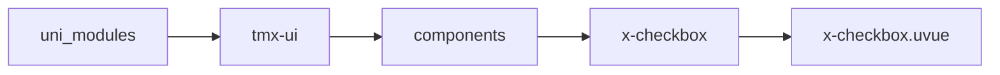
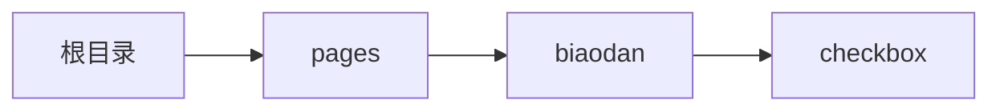

# 多选框 xCheckbox
-------
<ViewMobile url="/pages/biaodan/checkbox" />

## 介绍

使用时,x-checkbox能单独使用，如果要与x-checkbox-group配合，只能是它的的直接子节点

## 平台兼容

| Harmony | H5 | andriod | IOS | 小程序 | UTS | UNIAPP-X SDK | version |
| --- | --- | --- | --- | --- | --- | --- | --- |
| ☑ | ☑ | ☑️ | ☑️ | ☑️ | ☑️ | 4.76+ | 1.1.18 |


## 文件路径

``` ts

@/uni_modules/tmx-ui/components/x-checkbox/x-checkbox.uvue
```



## 使用

``` ts

<x-checkbox></x-checkbox>
```

## Props 属性

| 名称 | 说明 | 类型 | 默认值 |
| ------ | ---- | ---- | ---- |
| color | `当前主题色，空值时取全局`<br> | `string` | `""` |
| unCheckColor | `当前未选中时主题色，空值时取全局`<br> | `string` | `""` |
| darkUnCheckColor | `当前未选中时的暗黑主题色`<br> | `string` | `""` |
| modelValue | `当前选中的值，受控时为v-model="x"`<br> | `union` | `''` |
| defaultChecked | `非受控下默认选中的状态`<br> | `boolean` | `false` |
| value | `选中的值`<br> | `union` | `'1'` |
| unCheckValue | `未选中的值`<br> | `union` | `''` |
| disabled | `是否禁用`<br> | `boolean` | `false` |
| icon | `选中的图标名称。`<br> | `string` | `"check-line"` |
| label | `右侧文字。`<br> | `string` | `""` |
| hiddenCheckbox | `是否隐藏选中框。然后利用默认插槽自定义选中所有样式和状态。`<br> | `boolean` | `false` |
| indeterminate | `半选中`<br> | `boolean` | `false` |
| size | `尺寸`<br> | `string` | `"24"` |
| iconSize | `中间小图标大小`<br> | `string` | `"20"` |
| labelFontSize | `文字大小`<br> | `string` | `"15px"` |
| labelSpace | `label和选中框间的间距`<br> | `string` | `'10'` |
| round | `圆角`<br> | `string` | `'4'` |


## Events 事件

| 名称 | 参数 | 说明 |
| ------ | ---- | ---- |
| change | `check: Booleanvalue: union` | 用户交互切换，选中变换时触发。 |
| click | `-` | 点击事件 |
| update:modelValue | `-` | - |


## Slots 插槽

| 名称 | 说明 | 数据 |
| ------ | ---- | ---- |
| label | `默认文本插槽` | checked: boolean<br>checked: number<br>value: boolean<br>value: number<br> |


## Ref 方法

| 名称 | 参数 | 返回值 | 说明 |
| ------ | ---- | ---- | ---- |


## 示例文件路径

``` json

/pages/biaodan/checkbox
```



## 示例源码

::: details uvue

<<< ../../../../pages/biaodan/checkbox.uvue{vue}

:::

