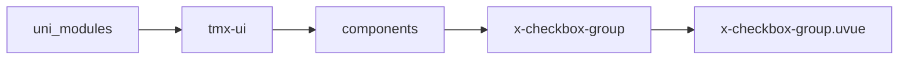
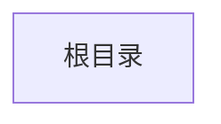

# 多选框组 xCheckboxGroup
-------
<ViewMobile url="" />

## 介绍

使用时,从1.1.2开始允许是非直接x-checkbox子节点布局,但考虑到性能建议是直接子节点.

## 平台兼容

| Harmony | H5 | andriod | IOS | 小程序 | UTS | UNIAPP-X SDK | version |
| --- | --- | --- | --- | --- | --- | --- | --- |
| ☑ | ☑ | ☑️ | ☑️ | ☑️ | ☑️ | 4.76+ | 1.1.18 |


## 文件路径

``` ts

@/uni_modules/tmx-ui/components/x-checkbox-group/x-checkbox-group.uvue
```



## 使用

``` ts

<x-checkbox-group></x-checkbox-group>
```

## Props 属性

| 名称 | 说明 | 类型 | 默认值 |
| ------ | ---- | ---- | ---- |
| modelValue | `当前选中的值。`<br> | `Array` | `():Array<string number boolean> => [] as Array<string number boolean>` |
| direction | `对齐方式`<br> | `union` | `"row"` |
| max | `最大选择数量，-1表示不限制。`<br> | `number` | `-1` |


## Events 事件

| 名称 | 参数 | 说明 |
| ------ | ---- | ---- |
| change | `val: union` | 选项变化时触发。 |
| update:modelValue | `-` | - |


## Slots 插槽

| 名称 | 说明 | 数据 |
| ------ | ---- | ---- |
| default | `从1.1.2开始允许是非直接x-checkbox子节点布局,但考虑到性能建议是直接子节点.` | - |


## Ref 方法

| 名称 | 参数 | 返回值 | 说明 |
| ------ | ---- | ---- | ---- |
| addItem | - | `-` | 添加多选项 * |
| getAllSelecteds | - | `-` | 获取所有选中的值 * |


## 示例文件路径

``` json


```



## 示例源码

::: details uvue


:::

