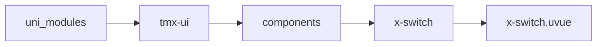

# 开关 xSwitch
-------
<ViewMobile url="/pages/biaodan/switch" />

## 介绍

开关，用于直观的展示选项表单的选择。

## 平台兼容

| Harmony | H5 | andriod | IOS | 小程序 | UTS | UNIAPP-X SDK | version |
| --- | --- | --- | --- | --- | --- | --- | --- |
| ☑ | ☑ | ☑️ | ☑️ | ☑️ | ☑️ | 4.76+ | 1.1.18 |


## 文件路径

``` ts

@/uni_modules/tmx-ui/components/x-switch/x-switch.uvue
```



## 使用

``` ts

<x-switch></x-switch>
```

## Props 属性

| 名称 | 说明 | 类型 | 默认值 |
| ------ | ---- | ---- | ---- |
| color | `激活时的背景色,空值时取全局的值。`<br> | `string` | `""` |
| bgColor | `未激活时的背景`<br> | `string` | `"info"` |
| darkBgColor | `未激活时的暗黑背景`<br>`空取inputDarkColor`<br> | `string` | `""` |
| btnColor | `按钮的背景色`<br> | `string` | `"white"` |
| size | `尺寸`<br> | `union` | `"normal"` |
| space | `间隙，px单位`<br> | `number` | `2` |
| modelValue | `当前打开的状态，默认为false`<br>`等同v-model=""`<br> | `boolean` | `false` |
| disabled | `是否禁用`<br> | `boolean` | `false` |
| loading | `是否加载中`<br> | `boolean` | `false` |
| label | `开关文字数组第一个为开，后一个为关`<br> | `Array` | `[] as string[]` |
| round | `圆角。空值时取全局值。`<br> | `string` | `""` |
| activeIcon | `激活时的按钮图标，不提供不显示`<br> | `string` | `""` |
| icon | `未激活时的图标，不提供不显示`<br> | `string` | `""` |
| beforeChange | `开关时执行执行的异步函数，会返回当前操作的值，如果返回异步Promise<boolean> false,会操作失败`<br>`函数类型为：(val: boolean) => Promise<boolean>`<br> | `xSwitchTypeCallbackType` | `(val:boolean) : Promise<boolean> => {     return Promise.resolve(true) }` |


## Events 事件

| 名称 | 参数 | 说明 |
| ------ | ---- | ---- |
| change | `status: boolean` | 状态变换时触发。 |
| click | `status: boolean` | 组件被点击时触发。 |
| update:modelValue | `-` | 等同v-model="" |


## Slots 插槽

| 名称 | 说明 | 数据 |
| ------ | ---- | ---- |


## Ref 方法

| 名称 | 参数 | 返回值 | 说明 |
| ------ | ---- | ---- | ---- |


## 示例文件路径

``` json

/pages/biaodan/switch
```


## 示例源码

::: details uvue

<<< ../../../../pages/biaodan/switch.uvue{vue}

:::

