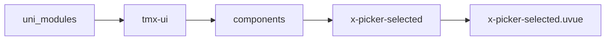
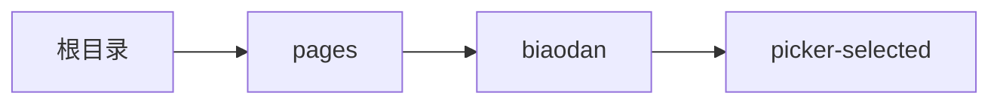

# 搜索选择 xpickerSelected
-------
<ViewMobile url="/pages/biaodan/picker-selected" />

## 介绍

弹层式大数据列表筛选，搜索。可异步加载数据。可针对本地搜索及异步搜索加载数据，虚拟列表支持。

## 平台兼容

| Harmony | H5 | andriod | IOS | 小程序 | UTS | UNIAPP-X SDK | version |
| --- | --- | --- | --- | --- | --- | --- | --- |
| ☑ | ☑ | ☑️ | ☑️ | ☑️ | ☑️ | ☑️ | ☑️ | 4.76+ | 1.1.18 |


## 文件路径

``` ts

@/uni_modules/tmx-ui/components/x-picker-selected/x-picker-selected.uvue
```



## 使用

``` ts

<x-picker-selected></x-picker-selected>
```

## Props 属性

| 名称 | 说明 | 类型 | 默认值 |
| ------ | ---- | ---- | ---- |
| modelValue | `当前选中的数据，any数组string[],number[]`<br>`否则报错，无法运行。`<br> | `Array` | `() => [] as any[]` |
| modelShow | `当前打开的状态。`<br>`等同v-model:model-show`<br> | `boolean` | `false` |
| modelStr | `回显当前选中的文本，只输出`<br>`等同v-model:model-str`<br> | `Array` | `() => [] as string[]` |
| title | `顶部标题,默认：请选择`<br> | `string` | `""` |
| cancelText | `取消按钮的文本,默认：取消`<br> | `string` | `""` |
| confirmText | `确认按钮的文本,默认：确认`<br> | `string` | `""` |
| filterKey | `搜索的字段名称`<br> | `string` | `"text"` |
| labelKey | `显示文本的字段`<br> | `string` | `"text"` |
| idKey | `列表字段的唯一标识`<br>`注意它的数据是number或者string类型.`<br> | `string` | `"id"` |
| list | `数据列表。`<br> | `Array` | `() => [] as UTSJSONObject[]` |
| localSearch | `默认采用本地对list的结果集进行筛选搜索。`<br>`如果禁用用，你可以自行通过search事件来搜索`<br>`并赋值给list更新结果。`<br> | `boolean` | `true` |
| multiple | `是否允许多选`<br> | `boolean` | `true` |
| isRadioMode | `当设置multiple为false时`<br>`是否允许为单选唯一模式,即不允许取消唯一项,意味着一旦选中一项就无法清空或者取消.`<br> | `boolean` | `false` |
| lazyContent | `是否懒加载内部内容。`<br>`当前你的列表内容非常多，且影响打开的动画性能时，请务必`<br>`设置此项为true，以获得流畅视觉效果。`<br> | `boolean` | `false` |
| lazyDuration | `lazyContent的延迟时间 单位 ms`<br>`如果你的 app效果不行，请加大此值`<br> | `number` | `100` |
| itemHeight | `项目的高度.不要去动态改变高,内部是listview item虚拟列表动态改高`<br>`会出现问题的.`<br> | `string` | `"50"` |
| zIndex | `层级`<br> | `number` | `1100` |
| showClose | `是否显示关闭按钮`<br> | `boolean` | `false` |
| refresh | `下拉刷新时v-model:refresh,触发时会设置为true，结束时需要自行设置为false`<br>`来结束刷新。`<br> | `boolean` | `false` |
| bottomRefresh | `触底刷新时，v-model:bottomR-refresh,触发时会设置为true，结束时需要自行设置为false`<br>`来结束刷新。`<br> | `boolean` | `false` |
| disabledPull | `是否禁用下拉刷新`<br> | `boolean` | `true` |
| disabledBottom | `是否禁用触底刷新`<br> | `boolean` | `true` |
| disabled | `是否禁用弹出`<br> | `boolean` | `false` |
| widthCoverCenter | `宽屏时是否让内容剧中显示`<br>`并限制其宽为屏幕宽，只展示中间内容以适应宽屏。`<br> | `boolean` | `false` |


## Events 事件

| 名称 | 参数 | 说明 |
| ------ | ---- | ---- |
| bottomRefresh | `-` | 触底刷新时触发，需要自行设置属性bottomRefresh为false结束状态 |
| refresh | `-` | 下拉刷新时触发，需要自行设置属性refresh为false结束状态 |
| search | `keyword: string` | 搜索时触发 |
| confirm | `ids: any[]data: UTSJSONObject[]` | 确认选择时触发 |
| cancel | `-` | 取消搜索时触发 |
| open | `-` | 显示弹层时触发，<br>可以用来在此第一次加载list异步数据。 |
| update:modelShow | `-` | 变量控制打开状态<br>等同v-model:model-show |
| update:modelStr | `-` | 自动回显文本数组，此属性只对外输出。 |
| update:bottomRefresh | `-` | v-model:bottomR-refresh |
| update:refresh | `-` | v-model:refresh |
| update:modelValue | `-` | v-model:modelValue |


## Slots 插槽

| 名称 | 说明 | 数据 |
| ------ | ---- | ---- |
| default | `插槽,默认触发打开选择器。你的默认布局可以放置在这里。` | label: string<br> |
| item | `动态循环列表的项目插槽` | item: xPickerSelectedListyType<br> |


## Ref 方法

| 名称 | 参数 | 返回值 | 说明 |
| ------ | ---- | ---- | ---- |
| open | - | `-` | 打开选择器 * |
| close | - | `-` | 关闭选择器 * |
| clearAll | - | `-` | 清空选择 * |
| selectedAll | - | `-` | 全选 * |
| clearSearchKey | - | `-` | 清空搜索框内容 * |


## 示例文件路径

``` json

/pages/biaodan/picker-selected
```



## 示例源码

::: details uvue

<<< ../../../../pages/biaodan/picker-selected.uvue{vue}

:::

