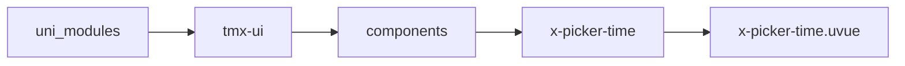

# 时间选择器 xPickerTime
-------
<ViewMobile url="/pages/biaodan/picker-time" />

## 介绍

这是单独显示和控制选择时分秒选择器。如果你需要年月日到秒的全部选择请参考x-picker-date。

## 平台兼容

| Harmony | H5 | andriod | IOS | 小程序 | UTS | UNIAPP-X SDK | version |
| --- | --- | --- | --- | --- | --- | --- | --- |
| ☑ | ☑ | ☑️ | ☑️ | ☑️ | ☑️ | 4.76+ | 1.1.18 |


## 文件路径

``` ts

@/uni_modules/tmx-ui/components/x-picker-time/x-picker-time.uvue
```



## 使用

``` ts

<x-picker-time></x-picker-time>
```

## Props 属性

| 名称 | 说明 | 类型 | 默认值 |
| ------ | ---- | ---- | ---- |
| modelValue | `当前时间,与modelStr不同，此提供的值必须是正常的时间格式xx:xx:xx`<br>`否则报错，无法运行。`<br> | `string` | `""` |
| modelStr | `当前时间经过format格式化后输出的值。`<br>`此值不会处理输入，只输出显示。`<br> | `string` | `""` |
| modelShow | `当前打开的状态。`<br>`等同v-model:model-show`<br> | `boolean` | `false` |
| lazyContent | `是否懒加载内部内容。`<br>`当前你的列表内容非常多，且影响打开的动画性能时，请务必`<br>`设置此项为true，以获得流畅视觉效果。如果选择数据较少没有必要打开`<br>`要兼容微信就必须打开为true,非微信可以设置为false`<br> | `boolean` | `false` |
| title | `顶部标题`<br> | `string` | `""` |
| cancelText | `取消按钮的文本`<br> | `string` | `""` |
| confirmText | `确认按钮的文本`<br> | `string` | `""` |
| start | `开始时间：请提供正确的时间格式xx:xx:xx`<br> | `string` | `""` |
| end | `结束时间：请提供正确的时间格式xx:xx:xx`<br> | `string` | `""` |
| type | `精确到的级别`<br>`hour:小时`<br>`minute:小时分钟`<br>`second:小时分钟秒`<br> | `union` | `"second"` |
| format | `输出时间格式，只对v-model:modelStr有效`<br>`有效格式：`<br>`hh小时`<br>`mm分钟`<br>`ss秒`<br> | `string` | `"hh:mm:ss"` |
| cellUnits | `上方的单位名称,'小时', '分钟', '秒数'`<br> | `Array` | `() => [] as string[]` |
| zIndex | `层级`<br> | `number` | `1100` |
| showClose | `是否显示关闭按钮`<br> | `boolean` | `false` |
| disabled | `是否禁用弹出`<br> | `boolean` | `false` |
| widthCoverCenter | `宽屏时是否让内容剧中显示`<br>`并限制其宽为屏幕宽，只展示中间内容以适应宽屏。`<br> | `boolean` | `false` |


## Events 事件

| 名称 | 参数 | 说明 |
| ------ | ---- | ---- |
| cancel | `-` | 取消时触发 |
| confirm | `date: string` | 确认触发 |
| change | `date: string` | 滑动变换时触发 |
| update:modelShow | `-` | 变量控制打开状态<br>等同v-model:model-show |
| update:modelStr | `-` | 经格式化后的值。等同v-model:model-str |
| update:modelValue | `-` | - |


## Slots 插槽

| 名称 | 说明 | 数据 |
| ------ | ---- | ---- |
| default | `插槽,默认触发打开选择器。你的默认布局可以放置在这里。` | - |


## Ref 方法

| 名称 | 参数 | 返回值 | 说明 |
| ------ | ---- | ---- | ---- |


## 示例文件路径

``` json

/pages/biaodan/picker-time
```


## 示例源码

::: details uvue

<<< ../../../../pages/biaodan/picker-time.uvue{vue}

:::

