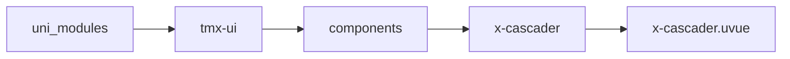
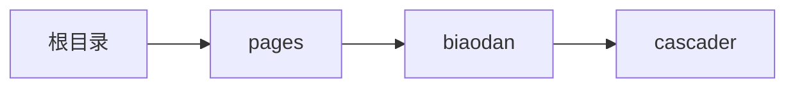

# 极联器 xCascader
-------
<ViewMobile url="/pages/biaodan/cascader" />

## 介绍

极联选择器，单选模式。

## 平台兼容

| Harmony | H5 | andriod | IOS | 小程序 | UTS | UNIAPP-X SDK | version |
| --- | --- | --- | --- | --- | --- | --- | --- |
| ☑ | ☑ | ☑️ | ☑️ | ☑️ | ☑️ | 4.76+ | 1.1.18 |


## 文件路径

``` ts

@/uni_modules/tmx-ui/components/x-cascader/x-cascader.uvue
```



## 使用

``` ts

<x-cascader></x-cascader>
```

## Props 属性

| 名称 | 说明 | 类型 | 默认值 |
| ------ | ---- | ---- | ---- |
| width | `宽,可以为auto`<br> | `string` | `'auto'` |
| height | `高，不可为auto。`<br> | `string` | `'150'` |
| list | `数据结构`<br> | `Array` | `():CASCADER_ITEM_INFO[] => [] as CASCADER_ITEM_INFO[]` |
| modelValue | `当前选中项的id`<br> | `string` | `` |
| fontSize | `项目文字大小id`<br> | `string` | `"16"` |
| itemTextColor | `选项项目未选中的文字颜色`<br> | `string` | `"#333333"` |
| darkItemTextColor | `选项项目未选中的暗黑文字颜色，空值是取白色`<br> | `string` | `""` |
| itemActiveColor | `选项项目选中的文字颜色，空值取全局主题`<br> | `string` | `""` |
| sliderContentBgColor | `内容区域背景颜色`<br> | `string` | `'rgba(0,0,0,0)'` |
| showCurrentBtn | `是否在有下级的项目上显示选择本级按钮.`<br>`当用户选中了本级时就同选择最后一项一样会触发confirm及同步vmodel值`<br> | `boolean` | `` |


## Events 事件

| 名称 | 参数 | 说明 |
| ------ | ---- | ---- |
| change | `ids: String[]` | 选中触发时变化，只要路径变化了就会触发 |
| cellClick | `item: CASCADER_TREE_ITEMparentIndex: numberchildrenIndex: number` | 点击项目时触发 |
| confirm | `id: Stringids: String[]` | 最后一项时触发,或者选择本级时触发 |
| update:modelValue | `id: String` | 等同v-model,或者选择本级时触发 |


## Slots 插槽

| 名称 | 说明 | 数据 |
| ------ | ---- | ---- |
| header | `顶部头菜单导航插槽,你可以完全写自己的导航样式` | menus: CASCADER_ITEM_INFO[]<br> |


## Ref 方法

| 名称 | 参数 | 返回值 | 说明 |
| ------ | ---- | ---- | ---- |


## 示例文件路径

``` json

/pages/biaodan/cascader
```



## 示例源码

::: details uvue

<<< ../../../../pages/biaodan/cascader.uvue{vue}

:::

