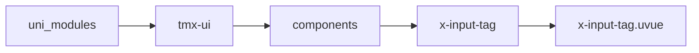
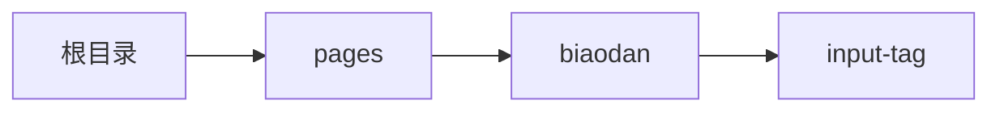

# 标签输入框 xInputTag
-------
<ViewMobile url="/pages/biaodan/input-tag" />

## 介绍

可通过键盘或者按钮，输入框输入字段回车保存标签词

## 平台兼容

| Harmony | H5 | andriod | IOS | 小程序 | UTS | UNIAPP-X SDK | version |
| --- | --- | --- | --- | --- | --- | --- | --- |
| ☑ | ☑ | ☑️ | ☑️ | ☑️ | ☑️ | 4.76+ | 1.1.18 |


## 文件路径

``` ts

@/uni_modules/tmx-ui/components/x-input-tag/x-input-tag.uvue
```



## 使用

``` ts

<x-input-tag></x-input-tag>
```

## Props 属性

| 名称 | 说明 | 类型 | 默认值 |
| ------ | ---- | ---- | ---- |
| bgColor | `输入框背景及标签背景`<br> | `string` | `"#f5f5f5"` |
| darkBgColor | `输入框的暗黑背景色`<br>`空值读取全局的Input暗黑背景色`<br> | `string` | `""` |
| btnColor | `右边按钮主题色，空取全局主题色`<br> | `string` | `""` |
| fontSize | `文本大小`<br> | `string` | `"16"` |
| fontColor | `文本颜色，暗黑时取白`<br> | `string` | `"#1d1d1f"` |
| width | `宽`<br> | `string` | `"auto"` |
| height | `高`<br> | `string` | `"40"` |
| round | `圆角`<br> | `string` | `""` |
| placeholder | `输入提示词，默认：请输入并回车`<br> | `string` | `""` |
| modelValue | `双向绑定`<br> | `Array` | `(): string[] => [] as string[]` |
| postion | `标签在内还是在外`<br> | `POSITIONTYPE` | `"out"` |
| showBtn | `postion为in时,可以控制隐藏按钮.`<br> | `boolean` | `true` |
| btnText | `添加按钮的文本,默认：添加标签`<br> | `string` | `""` |
| confirmType | `设置键盘右下角按钮的文字，仅在 type为text 时生效。`<br> | `string` | `"done"` |
| maxCount | `最佳输入标签数量,只有用户主动输入才会触发此限制`<br>`你代码赋值不会限制.-1表示不限制`<br> | `number` | `-1` |


## Events 事件

| 名称 | 参数 | 说明 |
| ------ | ---- | ---- |
| change | `value: mixed` | 标签变化时触发 |
| update:modelValue | `value: mixed` | 等同v-model |


## Slots 插槽

| 名称 | 说明 | 数据 |
| ------ | ---- | ---- |
| tag | `标签插槽，如果对标签样式不喜欢可通过此修改。` | tags: string[]<br> |


## Ref 方法

| 名称 | 参数 | 返回值 | 说明 |
| ------ | ---- | ---- | ---- |


## 示例文件路径

``` json

/pages/biaodan/input-tag
```



## 示例源码

::: details uvue

<<< ../../../../pages/biaodan/input-tag.uvue{vue}

:::

