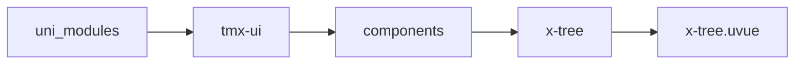
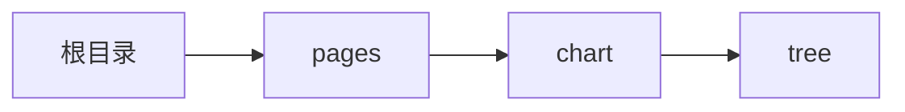

# 树 xTree
-------
<ViewMobile url="/pages/chart/tree" />

## 介绍

无限嵌套，可以异步加载。可以单独控制展开和关闭。

## 平台兼容

| Harmony | H5 | andriod | IOS | 小程序 | UTS | UNIAPP-X SDK | version |
| --- | --- | --- | --- | --- | --- | --- | --- |
| ☑ | ☑ | ☑️ | ☑️ | ☑️ | ☑️ | 4.76+ | 1.1.18 |


## 文件路径

``` ts

@/uni_modules/tmx-ui/components/x-tree/x-tree.uvue
```



## 使用

``` ts

<x-tree></x-tree>
```

## Props 属性

| 名称 | 说明 | 类型 | 默认值 |
| ------ | ---- | ---- | ---- |
| modelValue | `等同v-model，当前选中的id`<br> | `Array` | `() : string[] => [] as string[]` |
| folderId | `需要默认展开的父级id`<br>`如果这个id在深层等级，那它的所有父级都会被展开。`<br>`比如["1-2"]，此时1-2在最深级，那么它的父"1","1-1"会全部被默认打开`<br>`因此["1-2"]与["1","1-1","1-2"]其实没有区别`<br> | `Array` | `() : string[] => [] as string[]` |
| parentSelectedFullChildren | `是否允许选中父级的时候把它的所有子级也选上。`<br>`注意这个属性的区别,如果你打开,那么意味着你无法控制父框选中状态,它的状态由它的子集来控制`<br>`比如子集全选中时,它自动选中,如果部分选中(它还是不会选中,但会有半选中状态),如果子集没有全选中,它会自动取消选中.点击本身时会取消或者选中所有子.`<br>`如果你设置为false,那就表示所有节点可以单独选择,它不受子节点控制.点击自己时,也不会选中子节点.`<br> | `boolean` | `false` |
| disabledParentBox | `是否禁用父框选中,如果不禁用，但你的数据禁用了，还是会禁用。`<br>`但不影响你赋值选中`<br> | `boolean` | `false` |
| disabled | `是否停用选中功能，只能是已读状态了`<br>`但不影响你赋值选中`<br> | `boolean` | `false` |
| list | `列表数据,请一定要包含children字段代表子级。`<br>`如果需要异步加载需要包含一个children:[]空数组，如果没有子级`<br>`就不要包含children字段。字段:showEdite 显示编辑按钮,字段:showRemove显示删除节点按钮`<br>`showAdd 增加下级`<br> | `Array` | `() : UTSJSONObject[] => [] as UTSJSONObject[]` |
| idKey | `id字段名称`<br> | `string` | `"id"` |
| labelKey | `标题名称`<br> | `string` | `"text"` |
| color | `选中时的高亮颜色或者主题`<br> | `string` | `""` |
| beforeOpenFloder | `异步选项时执行的异步加载`<br>`需要返回 Promise<UTSJSONObject[]>来自动填充到当前级别中的数据。`<br> | `callbackType` | `(itemId : string) : Promise<UTSJSONObject[]> => {     return Promise.resolve([] as UTSJSONObject[]) }` |
| floaderIcon | `关闭和打开时图标/图片地址`<br>`必须为长度2,第一项关闭时图标,第2项关闭时图标`<br> | `Array` | `() : string[] => ['add-circle-line','indeterminate-circle-line'] as string[]` |
| showFloaderIcon | `是否显示默认前置开和关的图标`<br> | `boolean` | `true` |
| showChecked | `是否显示选中的box图标`<br> | `boolean` | `true` |
| checkedIcon | `选中与未选中时的图标/图片地址`<br>`必须为长度2,第一项未选中,第二项选中时图标`<br> | `Array` | `() : string[] => ['checkbox-blank-circle-line','checkbox-circle-fill'] as string[]` |


## Events 事件

| 名称 | 参数 | 说明 |
| ------ | ---- | ---- |
| change | `ids: string[]allParent: string[]allChildrenId: string[]allIdsAndInd: string[]` | 选中切换时触发 |
| childrenClick | `-` | 节点标签被点击<br>@@param {UTSJSONObject} item - 打开的id数组 |
| openFolderChange | `-` | 父节点展开和关闭<br>@@param {string[]} ids - 打开的id数组 |
| update:folderId | `-` | 等同v-model:folder-id |
| update:modelValue | `-` | - |


## Slots 插槽

| 名称 | 说明 | 数据 |
| ------ | ---- | ---- |


## Ref 方法

| 名称 | 参数 | 返回值 | 说明 |
| ------ | ---- | ---- | ---- |


## 示例文件路径

``` json

/pages/chart/tree
```



## 示例源码

::: details uvue

<<< ../../../../pages/chart/tree.uvue{vue}

:::

