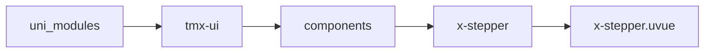
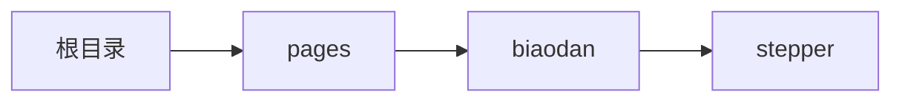

# 步进器 xStepper
-------
<ViewMobile url="/pages/biaodan/stepper" />

## 介绍

可整数，小数

## 平台兼容

| Harmony | H5 | andriod | IOS | 小程序 | UTS | UNIAPP-X SDK | version |
| --- | --- | --- | --- | --- | --- | --- | --- |
| ☑ | ☑ | ☑️ | ☑️ | ☑️ | ☑️ | 4.76+ | 1.1.18 |


## 文件路径

``` ts

@/uni_modules/tmx-ui/components/x-stepper/x-stepper.uvue
```



## 使用

``` ts

<x-stepper></x-stepper>
```

## Props 属性

| 名称 | 说明 | 类型 | 默认值 |
| ------ | ---- | ---- | ---- |
| modelValue | `当前值，可v-model`<br> | `number` | `0` |
| max | `最大值`<br> | `number` | `100` |
| width | `组件宽`<br> | `string` | `"auto"` |
| min | `最小值`<br> | `number` | `0` |
| autoHideBtn | `开启后自动隐藏限制的按钮`<br>`最小时隐藏减号按钮`<br> | `boolean` | `false` |
| disabled | `是否禁用整个组件`<br> | `boolean` | `false` |
| disabledInput | `是否禁用输入框`<br> | `boolean` | `false` |
| step | `步进值`<br> | `number` | `1` |
| decimalLen | `如果进步值是小数位需要设置此值`<br> | `number` | `0` |
| btnColor | `按钮的颜色`<br> | `string` | `"info"` |
| darkBtnColor | `按钮的暗黑颜色`<br>`空值读取全局的Input暗黑背景色`<br> | `string` | `""` |
| bgColor | `输入框的背景色`<br> | `string` | `"info"` |
| inputStyle | `输入框的自定样式`<br>`可以写背景字体等样式`<br> | `string` | `''` |
| darkBgColor | `输入框的暗黑背景色`<br>`空值读取全局的Input暗黑背景色`<br> | `string` | `""` |
| btnWidth | `按钮的宽`<br> | `string` | `"36"` |
| height | `输入框及按钮的高`<br> | `string` | `"36"` |
| round | `按钮的圆角。`<br> | `string` | `"4"` |
| splitBtn | `是否按钮与输入框独立开来`<br>`不和输入框粘一起。`<br> | `boolean` | `false` |
| btnFontColor | `按钮文本颜色，暗黑时取白色`<br> | `string` | `"#333333"` |
| fontColor | `文本颜色,暗黑时取白色`<br> | `string` | `"#333333"` |
| fontSize | `文本文字大小`<br> | `string` | `"14"` |
| beforeChange | `加减值时执行执行的异步函数，会返回当前操作的值，如果返回异步Promise<boolean> false,会操作失败`<br>`函数类型为：(val: number) => Promise<boolean>`<br> | `xStepperPropsTypeCallbackType` | `(val:number) : Promise<boolean> => {     return Promise.resolve(true) }` |
| autoFocus | `自动获取焦点`<br> | `boolean` | `false` |
| focus | `设置焦点`<br> | `boolean` | `false` |


## Events 事件

| 名称 | 参数 | 说明 |
| ------ | ---- | ---- |
| blurOn | `evt: UniInputBlurEvent` | 失焦事件，blur是关键字，因此名字不能取blur |
| focusOn | `evt: UniInputFocusEvent` | 获得焦点时触，focus是关键字，因此名字不能取foucs |
| change | `str: number` | 输入值或者点击按钮时触发 |
| update:modelValue | `-` | - |


## Slots 插槽

| 名称 | 说明 | 数据 |
| ------ | ---- | ---- |


## Ref 方法

| 名称 | 参数 | 返回值 | 说明 |
| ------ | ---- | ---- | ---- |


## 示例文件路径

``` json

/pages/biaodan/stepper
```



## 示例源码

::: details uvue

<<< ../../../../pages/biaodan/stepper.uvue{vue}

:::

