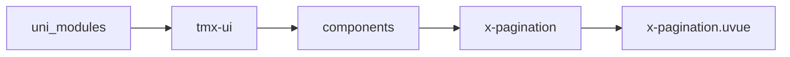

# 翻页器 xPagination
-------
<ViewMobile url="/pages/daohang/pagination" />

## 介绍

复杂和简便两种模式

## 平台兼容

| Harmony | H5 | andriod | IOS | 小程序 | UTS | UNIAPP-X SDK | version |
| --- | --- | --- | --- | --- | --- | --- | --- |
| ☑ | ☑ | ☑️ | ☑️ | ☑️ | ☑️ | 4.76+ | 1.1.18 |


## 文件路径

``` ts

@/uni_modules/tmx-ui/components/x-pagination/x-pagination.uvue
```



## 使用

``` ts

<x-pagination></x-pagination>
```

## Props 属性

| 名称 | 说明 | 类型 | 默认值 |
| ------ | ---- | ---- | ---- |
| modelValue | `当前页码`<br> | `number` | `1` |
| disabled | `是否彬`<br> | `boolean` | `false` |
| pageSize | `每页的数量`<br> | `number` | `10` |
| total | `总条数`<br> | `number` | `0` |
| maxButtons | `中间显示最多页码数量`<br>`注意它不是只整体页码是指多的时候中间的数量`<br>`如果不能理解请根据demo查看。`<br> | `number` | `3` |
| minButtons | `最小显示数量`<br>`如果总页小于此值，直接输出所有页码，上方的maxButtons失效。`<br> | `number` | `5` |
| showTotal | `是否显示总数（当simple开启时有效）`<br> | `boolean` | `true` |
| color | `当前默认背景`<br> | `string` | `"#f5f5f5"` |
| darkColor | `暗黑时如果空值取sheet暗黑背景`<br> | `string` | `""` |
| activeColor | `选中时的按钮背景，如果空值取全局color`<br> | `string` | `""` |
| btnWidth | `按钮宽，这里是最小宽`<br> | `string` | `"38"` |
| btnHeight | `按钮高`<br> | `string` | `"38"` |
| fontSize | `字号`<br> | `string` | `"14"` |
| fontColor | `字号颜色`<br> | `string` | `"#333333"` |
| fontDarkColor | `暗黑时的字号颜色`<br> | `string` | `"#ffffff"` |
| activeFontColor | `激活时字号颜色`<br> | `string` | `"#FFFFFF"` |
| activeFontDarkColor | `激活时暗黑的字号颜色`<br> | `string` | `"#ffffff"` |
| round | `按钮圆角`<br> | `string` | `"6"` |
| simple | `是否开启简单型模式。`<br> | `boolean` | `false` |


## Events 事件

| 名称 | 参数 | 说明 |
| ------ | ---- | ---- |
| change | `-` | 页码切换时触发<br>@@param {number} current 当前页码 |
| update:modelValue | `-` | - |


## Slots 插槽

| 名称 | 说明 | 数据 |
| ------ | ---- | ---- |


## Ref 方法

| 名称 | 参数 | 返回值 | 说明 |
| ------ | ---- | ---- | ---- |


## 示例文件路径

``` json

/pages/daohang/pagination
```


## 示例源码

::: details uvue

<<< ../../../../pages/daohang/pagination.uvue{vue}

:::

