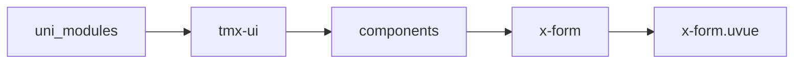
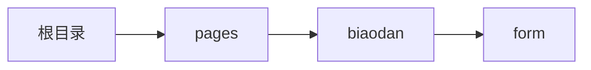

# 表单 xForm
-------
<ViewMobile url="/pages/biaodan/form" />

## 介绍

从1.1.2开始允许xform可以嵌套view进行form-item布局了,但建议不要嵌套太深,影响性能.

## 平台兼容

| Harmony | H5 | andriod | IOS | 小程序 | UTS | UNIAPP-X SDK | version |
| --- | --- | --- | --- | --- | --- | --- | --- |
| ☑ | ☑ | ☑️ | ☑️ | ☑️ | ☑️ | 4.76+ | 1.1.18 |


## 文件路径

``` ts

@/uni_modules/tmx-ui/components/x-form/x-form.uvue
```



## 使用

``` ts

<x-form></x-form>
```

## Props 属性

| 名称 | 说明 | 类型 | 默认值 |
| ------ | ---- | ---- | ---- |
| labelWidth | `标签宽（横向表单时有效）`<br>`不支持动态修改（uniappx 3.99不支持动态传递 inject）,可在子组件上动态修改`<br> | `string` | `"100"` |
| labelDirection | `不支持动态修改（uniappx 3.99不支持动态传递 inject）,可在子组件上动态修改`<br>`vertical,horizontal`<br> | `labelDirType` | `"horizontal"` |
| labelFontColor | `标签的文本颜色,不支持动态修改（uniappx 3.99不支持动态传递 inject）,可在子组件上动态修改`<br> | `string` | `"#333333"` |
| errorAutoPage | `出错时，是否滚动到表单的位置`<br>`不支持动态修改（uniappx 3.99不支持动态传递 inject）,可在子组件上动态修改`<br> | `boolean` | `true` |
| modelValue | `等同v-model`<br> | `any` | `{} as UTSJSONObject` |
| labelFontSize | `标签文本大小`<br>`不支持动态修改（uniappx 3.99不支持动态传递 inject）,可在子组件上动态修改`<br> | `string` | `"16"` |
| showLabel | `是否显示标题,不支持动态修改（uniappx 3.99不支持动态传递 inject）,可在子组件上动态修改`<br> | `boolean` | `true` |
| errorAlign | `错误标签的对齐方式,left,center,right`<br> | `errorAlignType` | `'left'` |
| rules | `rules这里提供和与formItem上提供的不冲突都可以校验`<br>`如果两个名称相同会被校验两次。如果两有一边提供也会校验一次。`<br> | `Map` | `():Map<string,FORM_RULE[]> => new Map<string,FORM_RULE[]>()` |
| watchValidStatus | `是否开启实时全部字段校验获取当前实时的校验状态，`<br>`通过vmodel:valid对外输出当前实时的校验值，当字段值改变时会一直监测并监听所有字段并返回结果到对外`<br>`如果你没有这个需求场景，请保持关闭状态，如果你确实外部需要实时改变并观察提交按钮状态可以打开，请在字段少的场景使用。`<br> | `boolean` | `false` |
| modelValid | `当前的校验状态，请不要外部改变此值，此值只对外输出当前校验状态`<br>`需要设置watchValidStatus为true才会实时监听并检测状态。请通过v-model:valid来得到状态值`<br> | `boolean` | `false` |


## Events 事件

| 名称 | 参数 | 说明 |
| ------ | ---- | ---- |
| submit | `result: FORM_SUBMIT_RESULT` | 按钮提交表单时触发。 |
| update:modelValid | `-` | 校验事件，这个不是submit是用户在输入内容或者在校验阶段向外发出的事件<br>里面包含了实时的校验信息，用于绑定外部的按钮提供实时的可提交状态。<br>它对外输出，不能够双向绑定对内更改校验状态。 |


## Slots 插槽

| 名称 | 说明 | 数据 |
| ------ | ---- | ---- |
| default | `插槽内只能放置x-form-item子节点组件` | - |


## Ref 方法

| 名称 | 参数 | 返回值 | 说明 |
| ------ | ---- | ---- | ---- |
| id | - | `-` | - |
| pushAdd | - | `-` | - |
| delItem | - | `-` | - |
| getRules | - | `-` | - |
| checkAsyncVaildStatus | - | `-` | 用来首次同步检测：modelValid,一定要在onready生命期中执行，并且你赋值完表数据后再来个,nextTick中执行本方法，可以确保不会有遗漏。 |
| valid | `keys: string[]` <br>  - `待校验的字段` <br>  | `-` | 手动执行触发校验函数，如果提供空数组，表示校验所有，如果提供了指定值，则表示只校验提供的字段。 |
| clearValid | - | `-` | 清除校验状态并回到初始状态。 |
| submit | - | `-` | - |


## 示例文件路径

``` json

/pages/biaodan/form
```



## 示例源码

::: details uvue

<<< ../../../../pages/biaodan/form.uvue{vue}

:::

