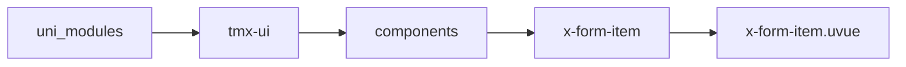

# 表单子组件 xFormItem
-------
<ViewMobile url="" />

## 介绍

从1.1.2开始允许非xform直接子节点了,也就是在xform可以嵌套view进行form-item布局了,但建议不要嵌套太深,影响性能.
1.1.17开始支持嵌套对象字段，key必须/分割如'user/id'，sdk不支持以.分割符。

## 平台兼容

| Harmony | H5 | andriod | IOS | 小程序 | UTS | UNIAPP-X SDK | version |
| --- | --- | --- | --- | --- | --- | --- | --- |
| ☑ | ☑ | ☑️ | ☑️ | ☑️ | ☑️ | 4.76+ | 1.1.18 |


## 文件路径

``` ts

@/uni_modules/tmx-ui/components/x-form-item/x-form-item.uvue
```



## 使用

``` ts

<x-form-item></x-form-item>
```

## Props 属性

| 名称 | 说明 | 类型 | 默认值 |
| ------ | ---- | ---- | ---- |
| label | `表单名称`<br> | `string` | `""` |
| showLabel | `是否显示标题`<br> | `boolean` | `true` |
| field | `校验的字段名称，字段名称一定要存在于form表单数据中。否则报错。`<br> | `string` | `""` |
| required | `是否是必填项。设置了此值，才会执行校验。`<br> | `boolean` | `false` |
| showRequired | `是否显示校验必填项前面的红*符号`<br> | `boolean` | `true` |
| rule | `校验规则对象`<br> | `Array` | `() : FORM_RULE[] => [] as FORM_RULE[]` |
| labelWidth | `标签宽（横向表单时有效），默认空值取父form统一的设置。`<br> | `string` | `""` |
| labelDirection | `默认空值取父form统一的设置。vertical\`<br>`horizontal`<br> | `string` | `""` |
| labelFontColor | `默认空值取父form统一的设置。标签的文本颜色`<br> | `string` | `""` |
| labelFontSize | `默认空值取父form统一的设置。标签的文本大小`<br> | `string` | `""` |
| labelAlign | `标签标题对齐方式 left,right,center`<br> | `string` | `"left"` |
| showBottomBorder | `是否显示底部边框`<br> | `boolean` | `true` |
| cellPadding | `排版布局上和下的间隙。[上,下]`<br> | `Array` | `() : string[] => ['10', '10'] as string[]` |
| labelPadding | `排版布局上和下的间隙。[上,下]，竖向时才生效`<br> | `Array` | `() : string[] => ['12', '12'] as string[]` |
| showError | `校验时，是否显示下边的出错信息`<br> | `boolean` | `true` |
| contentStyle | `默认区域内的自定样式`<br> | `string` | `""` |


## Events 事件

| 名称 | 参数 | 说明 |
| ------ | ---- | ---- |


## Slots 插槽

| 名称 | 说明 | 数据 |
| ------ | ---- | ---- |
| label | `标题` | - |
| default | `默认内容区域` | - |
| error | `出错提示的插槽` | - |


## Ref 方法

| 名称 | 参数 | 返回值 | 说明 |
| ------ | ---- | ---- | ---- |
| vaildCompele | - | `-` | - |
| getVaildStatus | - | `-` | - |
| clearValid | - | `-` | - |
| validByblur | - | `-` | - |


## 示例文件路径

``` json


```


## 示例源码

::: details uvue


:::

